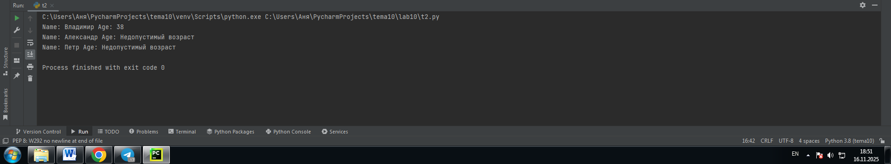
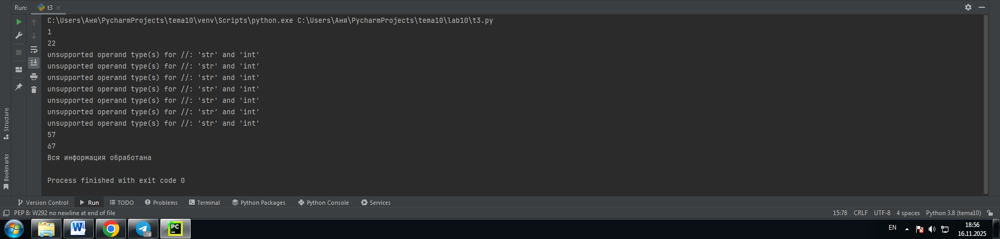
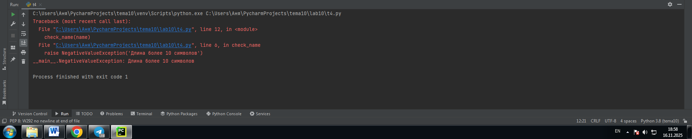
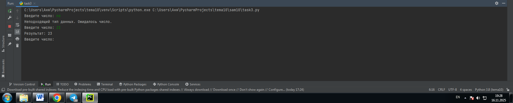
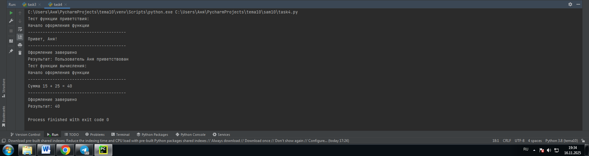
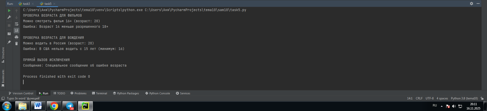

# Тема: Декораторы и исключения
- Студент: Демшина Анна Александровна
- Группа: ИВТ-23-1


## Таблица выполнения заданий

| Задание   | Лаб_раб | Сам_раб |
|-----------|:-------:|:-------:|
| Задание 1 |    +    |    +    |
| Задание 2 |    +    |    +    |
| Задание 3 |    +    |    +    |
| Задание 4 |    +    |    +    |
| Задание 5 |    +    |    +    |


## Лабораторная работа 10

### Задание 1. Вам нужно написать программу, которая будет считать числа Фибоначчи для 100 и запустить ее без этого декоратора и с ним, посмотреть на разницу во времени решения поставленной задачи.

```python
from functools import lru_cache

@lru_cache
def fibonacci(n):
    if n == 0:
        return 0
    elif n == 1:
        return 1
    return fibonacci(n - 1) + fibonacci(n - 2)

if __name__ == '__main__':
    print(fibonacci(100))
``` 
### Результат

 

**Вывод:** Выполняя это задание, я разобралась как работает декоратор @lru_cache для мемоизации. Я научилась применять его для оптимизации рекурсивных функций, что значительно ускоряет вычисления.

---

### Задание 2. Напишите декоратор для функции, который будет принимать все параметры вызываемой функции (имя, возраст) и проверять чтобы возраст был больше 0 и меньше 130. Причем заметьте, что неважно сколько пользователь введет данных на сайт к Илье, будут обрабатываться только первые 2 аргумента

```python
def check(input_func):
    def output_func(*args):
        name, age = args[0], args[1]
        if age < 0 or age > 130:
            age = 'Недопустимый возраст'
        input_func(name, age)
    return output_func

@check
def personal_info(name, age):
    print(f"Name: {name} Age: {age}")

if __name__ == '__main__':
    personal_info('Владимир', 38)
    personal_info('Александр', -5)
    personal_info('Петр', 138, 15, 48, 2)
```
### Результат



**Вывод:** Я разобралась как создавать декораторы для валидации параметров функций. Научилась обрабатывать произвольное количество аргументов через *args.

---

### Задание 3. Воспользуйтесь исключениями, чтобы неподходящий тип данных не ломал ваш сайт. Также дополнительно можете обернуть весь код функции в try/except/finally для того, чтобы программа вас оповестила о том, что выявлена какая-то ошибка или программа успешно выполнена

```python
def data(*args):
    try:
        for i in range(len(*args)):
            try:
                result = (args[0][i] * 15) // 10
                print(result)
            except Exception as ex:
                print(ex)
    except Exception as ex:
        print(ex)
    finally:
        print('Вся информация обработана')

if __name__ == '__main__':
    data([1, 15, 'Hello', 'i', 'try', 'to', 'crash', 'your', 'site', 38, 45])
```
### Результат


**Вывод:** Я научилась обрабатывать исключения в Python с помощью try/except блоков. Разобралась как использовать вложенные обработчики ошибок для защиты программы.

---

### Задание 4. Продолжая работу над сайтом, вы решили написать собственное исключение, которое будет вызываться в случае, если в функцию проверки имени при регистрации передана строка длиннее десяти символов, а если имя имеет допустимую длину, то в консоль выводиться “Успешная регистрация”

```python
class NegativeValueException(Exception):
    pass

def check_name(name):
    if len(name) > 10:
        raise NegativeValueException('Длина более 10 символов')
    else:
        print("Успешная регистрация")

if __name__ == '__main__':
    name = '123456789210'
    check_name(name)
```
### Результат



**Вывод:** Выполняя задание, я поняла как вызывать исключения с помощью raise и обрабатывать специфичные ошибки в программе.

---

### Задание 5. После запуска сайта вы поняли, что вам необходимо добавить логгер, для отслеживания его работы. Готовыми вариантами вы не захотели пользоваться, и поэтому решили создать очень простую пародию. Для этого создали две функции: __init__() (вызывается при создании класса декоратора в программе) и __call__() (вызывается при вызове декоратора). Создайте необходимый вам декоратор. Выведите все логи в консоль.

```python
class SiteChecker:
    def __init__(self, func):
        print('> Класс SiteChecker метод __init__ успешный запуск')
        self.func = func

    def __call__(self):
        print('> Проверка перед запуском', self.func.__name__)
        self.func()
        print('> Проверка безопасного выключения')

@SiteChecker
def site():
    print('Усердная работа сайта')

if __name__ == '__main__':
    print('>> Сайт запущен')
    site()
    print('>> Сайт выключен')
```
### Результат


**Вывод:** Выполняя задание, я поняла принцип создания системы логирования с помощью декораторов для отслеживания работы программы.

---


## Самостоятельная работа 10

### Задание 1. Вовочка решил заняться спортивным программированием на python, но для этого он должен знать за какое время выполняется его программа. Он решил, что для этого ему идеально подойдет декоратор для функции, который будет выяснять за какое время выполняется та или иная функция. Помогите Вовочке в его начинаниях и напишите такой декоратор.
```python
import time

def timer(func):
    def wrapper():
        start_time = time.perf_counter()
        func()
        end_time = time.perf_counter()
        print(f"\nВремя выполнения: {end_time - start_time:.6f} секунд")
    return wrapper

@timer
def fibonacci():
    fib1 = 0
    fib2 = 1
    for i in range(2, 200):
        fib1, fib2 = fib2, fib1 + fib2
    print(fib2, end='')

if __name__ == '__main__':
    fibonacci()
```
### Результат
  

**Вывод:** Разобралась с особенностями работы таймера, поняла важность выбора правильного метода для замера производительности.

---

### Задание 2. Создайте пустой файл и файл, в котором есть какая-то информация. Напишите код программы. Если файл пустой, то, нужно вызвать исключение (“бросить исключение”) и вывести в консоль “файл пустой”, а если он не пустой, то вывести информацию из файла.
```python
def read_file(filename):
    try:
        with open(filename, 'r', encoding='utf-8') as file:
            content = file.read()
            if not content:
                raise Exception("файл пустой")
            print(content)
    except FileNotFoundError:
        print("Файл не найден")
    except Exception as e:
        print(e)

if __name__ == '__main__':
    read_file('pustoi.txt')
    read_file('smth.txt')
```
### Результат
  

**Вывод:** Я разобралась как проверять содержимое файла и вызывать исключения.

---

### Задание 3. Напишите функцию, которая будет складывать 2 и введенное пользователем число, но если пользователь введет строку или другой неподходящий тип данных, то в консоль выведется ошибка “Неподходящий тип данных. Ожидалось число.”. Реализовать функционал программы необходимо через try/except и подобрать правильный тип исключения. Создавать собственное исключение нельзя. Проведите несколько тестов, в которых исключение вызывается и нет. Результатом выполнения задачи будет листинг кода и получившийся вывод в консоль.
```python
def add_two():
    try:
        number = int(input("Введите число: "))
        result = 2 + number
        print(f"Результат: {result}")
    except ValueError:
        print("Неподходящий тип данных. Ожидалось число.")

if __name__ == '__main__':
    add_two()
    add_two()
    add_two()
```
### Результат
  

**Вывод:** Я научилась обрабатывать исключения ValueError при вводе данных. Разобралась как перехватывать ошибки преобразования типов.

---

### Задание 4. Создайте собственный декоратор, который будет использоваться для двух любых вами придуманных функций. Декораторы, которые использовались ранее в работе нельзя воссоздавать. Результатом выполнения задачи будет: класс декоратора, две как-то связанными с ним функциями, скриншот консоли с выполненной программой и подробные комментарии, которые будут описывать работу вашего кода.
```python
class StyleDecorator:
    # Конструктор класса-декоратора, принимает функцию для декорирования
    def __init__(self, func):
        self.func = func  # Сохранение исходной функции

    # Метод __call__ вызывается при вызове декорированной функции
    def __call__(self, *args, **kwargs):
        print("Начало оформления функции")  # Сообщение перед выполнением
        print("-" * 40)  # Декоративная линия
        result = self.func(*args, **kwargs)  # Вызов исходной функции
        print("-" * 40)  # Декоративная линия
        print("Оформление завершено")  # Сообщение после выполнения
        return result  # Возвращаем результат исходной функции


# Применяем декоратор к первой функции
@StyleDecorator
def greet(name):
    # Функция приветствия пользователя
    print(f"Привет, {name}!")
    return f"Пользователь {name} приветствован"


# Применяем декоратор ко второй функции
@StyleDecorator
def calculate_sum(a, b):
    # Функция вычисления суммы двух чисел
    result = a + b
    print(f"Сумма {a} + {b} = {result}")
    return result


# Тестируем работу декорированных функций
if __name__ == '__main__':
    print("Тест функции приветствия:")
    greet_result = greet("Аня")
    print(f"Результат: {greet_result}")


    print("Тест функции вычисления:")
    calc_result = calculate_sum(15, 25)
    print(f"Результат: {calc_result}")
```
### Результат
  

**Вывод:** Я создала собственный класс-декоратор для оформления вывода функций. Выполняя задание, я поняла как декораторы могут добавлять дополнительную функциональность без изменения основного кода.

---

### Задание 5. Создайте собственное исключение, которое будет использоваться в двух любых фрагментах кода. Исключения, которые использовались ранее в работе нельзя воссоздавать.
```python
# Создаем собственное исключение для проверки возраста
class AgeRestrictionException(Exception):
    pass
# Первая функция - проверка возраста для фильма
def check_movie_age(age, movie_rating):
    if age < movie_rating:
        # Выбрасываем наше исключение с информацией о фильме
        raise AgeRestrictionException(f"Возраст {age} меньше разрешенного {movie_rating}+")
    print(f"Можно смотреть фильм {movie_rating}+ (возраст: {age})")
    return True


# Вторая функция - проверка возраста для вождения
def check_driving_age(age, country):
    driving_ages = {'Россия': 18, 'США': 16, 'Германия': 17}
    min_age = driving_ages.get(country, 18)

    if age < min_age:
        # Используется то же исключение для другой ситуации
        raise AgeRestrictionException(f"В {country} нельзя водить с {age} лет (минимум: {min_age})")
    print(f"Можно водить в {country} (возраст: {age})")
    return True


# Тест функций с исключениями
if __name__ == '__main__':
    print("ПРОВЕРКА ВОЗРАСТА ДЛЯ ФИЛЬМОВ")

    # Тест 1: Подходящий возраст для фильма
    try:
        check_movie_age(20, 16)  # 20 лет для фильма 16+
    except AgeRestrictionException as e:
        print(f"Ошибка: {e}")

    # Тест 2: Слишком молод для фильма
    try:
        check_movie_age(14, 18)  # 14 лет для фильма 18+
    except AgeRestrictionException as e:
        print(f"Ошибка: {e}")

    print("\nПРОВЕРКА ВОЗРАСТА ДЛЯ ВОЖДЕНИЯ")

    # Тест 3: Можно водить в России
    try:
        check_driving_age(20, 'Россия')  # 20 лет для России
    except AgeRestrictionException as e:
        print(f" Ошибка: {e}")

    # Тест 4: Нельзя водить в США
    try:
        check_driving_age(15, 'США')  # 15 лет для США
    except AgeRestrictionException as e:
        print(f"Ошибка: {e}")

    print("\nПРЯМОЙ ВЫЗОВ ИСКЛЮЧЕНИЯ")

    # Тест 5: Демонстрация прямого вызова исключения
    try:
        raise AgeRestrictionException("Специальное сообщение об ошибке возраста")
    except AgeRestrictionException as e:
        print(f"Сообщение: {e}")
```
### Результат
  

**Вывод:** Я создала универсальное исключение для проверки возрастных ограничений. Разобралась с применением одного исключения в разных контекстах.

---

## Общие выводы по теме
**Освоив работу с декораторами и исключениями, я научилась создавать собственные декораторы для модификации поведения функций и измерять время их выполнения. Практикуясь с исключениями, я разобралась как обрабатывать ошибки ввода данных, работать с файлами и создавать специализированные классы исключений для различных сценариев.**
