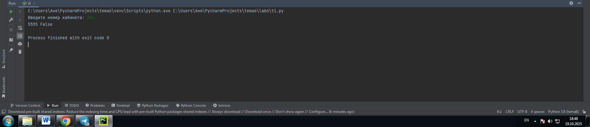
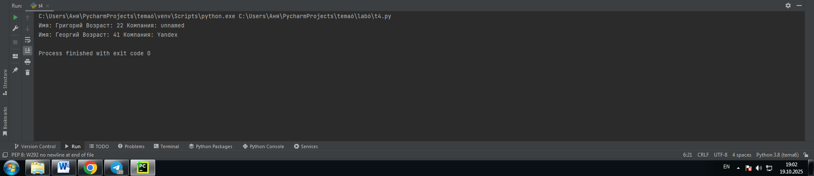
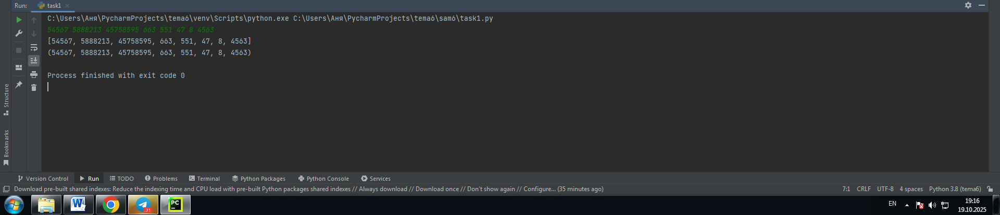
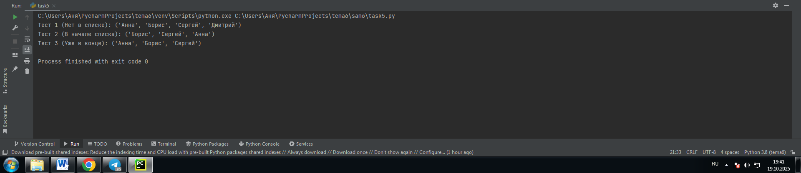

# Тема: Базовые коллекции: словари, кортежи

- Студент: Демшина Анна Александровна
- Группа: ИВТ-23-1


## Таблица выполнения заданий

| Задание   | Лаб_раб | Сам_раб |
|-----------|:-------:|:-------:|
| Задание 1 |    +    |    +    |
| Задание 2 |    +    |    +    |
| Задание 3 |    +    |    +    |
| Задание 4 |    +    |    +    |
| Задание 5 |    +    |    +    |


## Лабораторная работа 6

### Задание 1. В школе, где вы учились, узнали, что вы крутой программист и попросили написать программу для учителей, которая будет при вводе кабинета писать для него ключ доступа и статус, занят кабинет или нет. При написании программы необходимо использовать словарь (dict), который на вход получает номер кабинета, а выводит необходимую информацию. Если кабинета, который вы ввели нет в словаре, то в консоль в виде значения ключа нужно вывести “None” и виде статуса вывести “False”. По большому счету написав данную программу мы с вами научились заменять иногда громоздкую конструкцию if/elif/else. Поскольку здесь функционал словаря полностью повторяет функционал условия, но при этом у использования словарей в более сложных программах есть намного больше возможностей реализации.

```python
request = int(input('Введите номер кабинета: '))

dictionary = {
    101: {'key': 1234, 'access': True},
    102: {'key': 1337, 'access': True},
    103: {'key': 8943, 'access': True},
    104: {'key': 5555, 'access': False},
    None: {'key': None, 'access': False},
}

response = dictionary.get(request)
if not response:
    response = dictionary[None]
key = response.get('key')
access = response.get('access')
print(key, access)
``` 
### Результат

 

**Вывод:** Выполняя это задание, я разобралась в работе со словарями (dictionary) в Python, в частности, в использовании метода .get() для безопасного доступа к элементам и предоставлении значения по умолчанию (через ключ None), если запрошенный ключ отсутствует.

---

### Задание 2. Алексей решил создать самый большой словарь в мире. Для этого он придумал функцию dict_maker (**kwargs), которая принимает неограниченное количество параметров «ключ: значение» и обновляет созданный им словарь my_dict, состоящий всего из одного элемента «first» со значением «so easy». Помогите Алексею создать данную функцию. Ниже на скриншоте мы использовали встроенный модуль pprint, который выводит большие объемы информации более понятно для восприятия человеческим глазом. Иногда очень удобно использовать данную возможность Python.

```python
from pprint import pprint

my_dict = {'first': 'so easy'}

def dict_maker(**kwargs):
    my_dict.update(**kwargs)

dict_maker(a1=20, a3=54, a4=13)
dict_maker(name='Михаил', age=31, weight=70, eyes_color='blue')

pprint(my_dict)
```
### Результат


**Вывод:** Выполняя это задание, я научилась создавать функцию (dict_maker), которая принимает неограниченное количество именованных аргументов с помощью синтаксиса **kwargs и использовать их для обновления существующего словаря (my_dict) с помощью метода .update(). Я также узнала о полезности функции pprint из встроенного модуля pprint для аккуратного вывода больших словарей.

---

### Задание 3. Для решения некоторых задач бывает необходимо разложить строку на отдельные символы. Мы знаем что это можно сделать при помощи split(), у которого более гибкая настройка для разделения для этого, но если нам нужно посимвольно разделить строку без всяких условий, то для этого мы можем использовать кортежи (tuple). Для этого напишем любую строку, которую будем делить и “обвернем” ее в tuple и дальше мы можем как нам угодно с ней работать, например, сделать ее списком (тогда получится полный аналог split()) или же работать с ним дальше, как с кортежем.

```python
input_string = 'HelloWorld'
result = tuple(input_string)
print(result)
print(list(result))
```
### Результат


**Вывод:** Выполняя это задание, я научилась преобразовывать строку в кортеж (tuple()) и затем в список (list()), что является аналогом разделения (split()) строки по символам. Я разобралась, что встроенные функции tuple() и list() могут принимать итерируемый объект (например, строку) и создать из него соответствующую коллекцию.

---

### Задание 4. Вовочка решил написать крутую функцию, которая будет писать имя, возраст и место работы, но при этом на вход этой функции будет поступать кортеж. Помогите Вовочке написать эту программу.

```python
def personal_info(name, age, company='unnamed'):
    print(f'Имя: {name} Возраст: {age} Компания: {company}')
tom = ("Григорий", 22)
personal_info(*tom)
bob = ("Георгий", 41, "Yandex")
personal_info(*bob) 
```
### Результат



**Вывод:** Выполняя это задание, я научилась преобразовывать строку в кортеж (tuple()) и затем в список (list()), что является аналогом разделения (split()) строки по символам. Я разобралась, что встроенные функции tuple() и list() могут принимать итерируемый объект (например, строку) и создать из него соответствующую коллекцию.

---

### Задание 5. Для сопровождения первых лиц государства X нужен кортеж, но никто не может определиться с порядком машин, поэтому вам нужно написать функцию, которая будет сортировать кортеж, состоящий из целых чисел по возрастанию, и возвращает его. Если хотя бы один элемент не является целым числом, то функция возвращает исходный кортеж.

```python
def tuple_sort(tpl):
    for elm in tpl:
        if not isinstance(elm, int):
            return tpl
    return tuple(sorted(tpl))

if __name__ == '__main__':
    print(tuple_sort((5, 5, 3, 1, 9)))
    print(tuple_sort((5, 5, 2.1, '1', 9)))
```
### Результат


**Вывод:** Выполняя это задание, я научилась создавать функцию для обработки кортежей, которая использует встроенную функцию isinstance() для проверки типа данных каждого элемента. Я разобралась, что для сортировки кортежа с помощью sorted() все его элементы должны быть одного, сравнимого типа (в данном случае int), и как преобразовать результат обратно в кортеж (tuple()).

---

## Самостоятельная работа 6

### Задание 1. При создании сайта у вас возникла потребность обрабатывать данные пользователя в странной форме, а потом переводить их в нужные вам форматы. Вы хотите принимать от пользователя последовательность чисел, разделенных пробелом, а после переформатировать эти данные в список и кортеж. Реализуйте вашу задумку. Для получения начальных данных используйте input(). Результатом программы будет выведенный список и кортеж из начальных данных.
```python
user_input = input()
data_list_str = user_input.split()
data_list = [int(item) for item in data_list_str]
data_tuple = tuple(data_list)
print(data_list)
print(data_tuple)
```
### Результат
  

**Вывод:** Выполняя это задание, я научилась принимать строку чисел, разделённых пробелами, и использовать метод .split() для преобразования её в список строк. Затем я разобралась, как с помощью генератора списка (list comprehension) преобразовать этот список строк в список целых чисел, и как легко получить кортеж (tuple()) из этого списка.

---

### Задание 2. Николай знает, что кортежи являются неизменяемыми, но он очень упрямый и всегда хочет доказать, что он прав. Студент решил создать функцию, которая будет удалять первое появление определенного элемента из кортежа по значению и возвращать кортеж без него. Попробуйте повторить шедевр не признающего авторитеты начинающего программиста. Но учтите, что Николай не всегда уверен в наличии элемента в кортеже (в этом случае кортеж вернется функцией в исходном виде).
```python
def remove_first_occurrence(tpl, element_to_remove):
    if element_to_remove not in tpl:
        return tpl
    try:
        index_to_remove = tpl.index(element_to_remove)
    except ValueError:
        return tpl
    new_tpl = tpl[:index_to_remove] + tpl[index_to_remove + 1:]

    return new_tpl

print(remove_first_occurrence((1, 2, 3), 1))
print(remove_first_occurrence((1, 2, 3, 1, 2, 3, 4, 5, 2, 3, 4, 2, 4, 2), 3))
print(remove_first_occurrence((2, 4, 6, 6, 4, 2), 9))
```
### Результат
  

**Вывод:** Выполняя это задание, я научилась обходить неизменяемость кортежей путём создания нового кортежа на основе старого. Я разобралась, как использовать метод .index() для нахождения первого вхождения элемента и как применять срезы (slices) кортежа (tpl[:index] и tpl[index + 1:]) для исключения нужного элемента при объединении частей в новый кортеж.

---

### Задание 3. Ребята поспорили кто из них одним нажатием на numpad наберет больше повторяющихся цифр, но не понимают, как узнать победителя. Вам им нужно в этом помочь. Дана строка в виде случайной последовательности чисел от 0 до 9 (длина строки минимум 15 символов). Требуется создать словарь, который в качестве ключей будет принимать данные числа (т. е. ключи будут типом int), а в качестве значений – количество этих чисел в имеющейся последовательности. Для построения словаря создайте  функцию, принимающую строку из цифр. Функция должна возвратить словарь из 3-х самых часто встречаемых чисел, также эти значения нужно вывести в порядке возрастания ключа.
```python
def find_top_3_counts(number_string):
    all_counts = {}
    for char in number_string:
        digit = int(char)
        all_counts[digit] = all_counts.get(digit, 0) + 1

    sorted_items = sorted(
        all_counts.items(),
        key=lambda item: (item[1], -item[0]),
        reverse=True
    )
    top_3_items = sorted_items[:3]
    final_dict = dict(sorted(top_3_items, key=lambda item: item[0]))

    return final_dict

# Пример использования
random_numbers = "9112223333444445555556666667777777"
result_dict = find_top_3_counts(random_numbers)

print(result_dict)
```
### Результат
  

**Вывод:** Выполняя это задание, я научилась создавать функцию для обработки строк, которая подсчитывает частотусимволов, используя метод .get() в словаре. Я разобралась, как сортировать результаты с помощью sorted() по двум критериям (сначала по частоте, затем по ключу) и как гарантировать, что итоговый словарь из топ-3элементов будет отсортирован по возрастанию ключа.

---

### Задание 4. Ваш хороший друг владеет офисом со входом по электронным картам, ему нужно чтобы вы написали программу, которая показывала в каком порядке сотрудники входили и выходили из офиса. Определение сотрудника происходит по id. Напишите функцию, которая на вход принимает кортеж и случайный элемент (id), его можно придумать самостоятельно. Требуется вернуть новый кортеж, начинающийся с первого появления элемента в нем и заканчивающийся вторым его появлением включительно. Если элемента нет вовсе – вернуть пустой кортеж. Если элемент встречается только один раз, то вернуть кортеж, который начинается с него и идет до конца исходного. Входные данные: (1, 2, 3), 8) (1, 8, 3, 4, 8, 8, 9, 2), 8) (1, 2, 8, 5, 1, 2, 9), 8) Ожидаемый результат: () (8, 3, 4, 8) (8, 5, 1, 2, 9)
```python
def find_entry_exit_sequence(log_tuple, employee_id):
    if employee_id not in log_tuple:
        return ()
    first_occurrence_index = log_tuple.index(employee_id)

    try:
        second_occurrence_index = log_tuple.index(employee_id, first_occurrence_index + 1)
        return log_tuple[first_occurrence_index : second_occurrence_index + 1]

    except ValueError:
        return log_tuple[first_occurrence_index:]

# Примеры использования из задания
print(find_entry_exit_sequence((1, 2, 3), 8))
print(find_entry_exit_sequence((1, 8, 3, 4, 8, 8, 9, 2), 8))
print(find_entry_exit_sequence((1, 2, 8, 5, 1, 2, 9), 8))
```
### Результат
  

**Вывод:** Выполняя это задание, я научилась использовать метод .index() с двумя аргументами (.index(value, start_index)) для поиска последовательных появлений элемента в кортеже. Я разобралась, как применять блок try...except ValueError для обработки ситуации, когда элемент встречается только один раз, и как с помощью срезов кортежа возвращать нужную последовательность событий: от первого до второго включительно, или от первого до конца.

---

### Задание 5. Самостоятельно придумайте и решите задачу, в которой будут обязательно использоваться кортеж или список. Проведите минимум три теста для проверки работоспособности вашей задачи. Задача: Руководитель проекта должен проверить, кто из сотрудников сдал отчеты в срок. У вас есть кортеж, содержащий список всех сотрудников (строки). Требуется создать функцию, которая принимает этот кортеж и имя сотрудника. Функция должна добавить нового сотрудника в конец списка (т.е. вернуть новый кортеж с добавленным именем), но только если этого сотрудника еще нет в кортеже. Если сотрудник уже есть, функция должна вернуть кортеж, в котором его имя будет перемещено в самый конец списка (также возвращается новый кортеж).
```python
def update_employee_list(employee_tuple, new_employee):
    # Если сотрудника нет, он просто добавлятся в конец
    if new_employee not in employee_tuple:
        return employee_tuple + (new_employee,)
    else:
        # Если сотрудник есть, находится его индекс
        index_to_remove = employee_tuple.index(new_employee)

        # Если сотрудник уже в конце, возвращается исходный кортеж
        if index_to_remove == len(employee_tuple) - 1:
            return employee_tuple

        # Создается новый кортеж без этого сотрудника (исключая его срез)
        temp_tuple = employee_tuple[:index_to_remove] + employee_tuple[index_to_remove + 1:]

        # Добавление сотрудника в конец
        return temp_tuple + (new_employee,)


# Тестовые примеры (3 кейса)
# 1. Сотрудника нет (добавление)
employees_1 = ("Анна", "Борис", "Сергей")
print(f"Тест 1 (Нет в списке): {update_employee_list(employees_1, 'Дмитрий')}")

# 2. Сотрудник есть, но не в конце (перемещение в конец)
employees_2 = ("Анна", "Борис", "Сергей")
print(f"Тест 2 (В начале списка): {update_employee_list(employees_2, 'Анна')}")

# 3. Сотрудник есть, и он уже в конце списка (возврат без изменений)
employees_3 = ("Анна", "Борис", "Сергей")
print(f"Тест 3 (Уже в конце): {update_employee_list(employees_3, 'Сергей')}")
```
### Результат
  

**Вывод:** Выполняя это задание, я научилась демонстрировать надежность кода с помощью трех тестовых случаев, включая новый сценарий, где элемент, который нужно переместить, уже находится в самом конце кортежа. Я разобралась, как добавить условную проверку (if index_to_remove == len(employee_tuple) - 1) в функцию, чтобы избежать лишнего создания кортежа, если перемещение не требуется.

---

### Общие выводы по теме:
Выполняя задания, я освоила ключевые аспекты работы с коллекциями данных в Python — словарями, кортежами и списками. Я научилась безопасно работать со словарями, используя метод .get(), принимать неограниченное число аргументов функцией (**kwargs), и выполнять сложную сортировку по нескольким критериям для подсчёта частоты элементов. В работе с кортежами я разобралась, как обходить их неизменяемость путём создания новых объектов через срезы, и как использовать метод  .index() с дополнительным аргументом для поиска последовательных вхождений.
