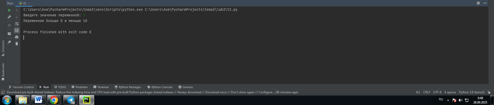
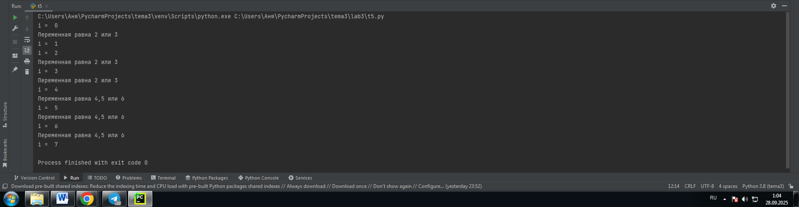
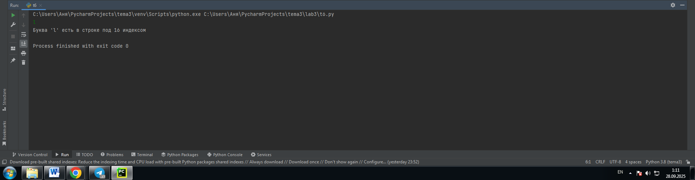
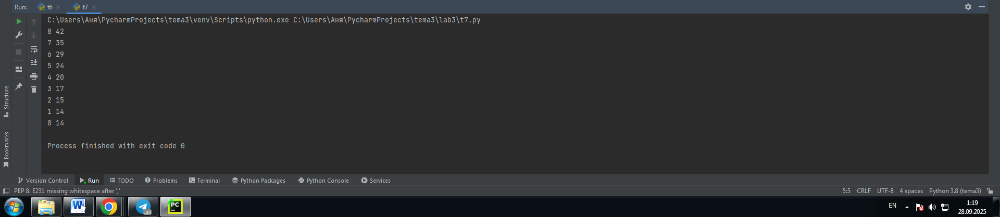
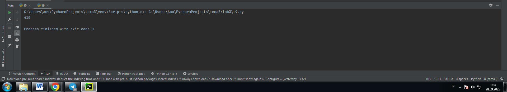
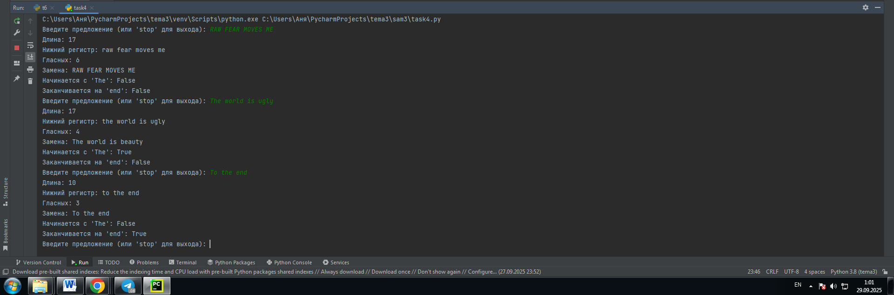
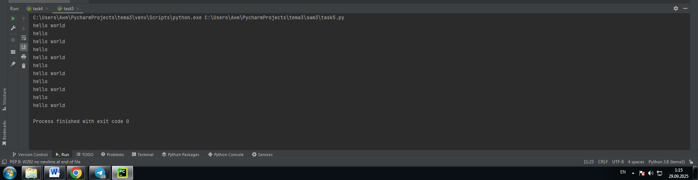

# Тема: Операторы, условия, циклы

- Студент: Демшина Анна Александровна
- Группа: ИВТ-23-1


## Таблица выполнения заданий

| Задание   | Лаб_раб | Сам_раб |
|-----------|:-------:|:-------:|
| Задание 1 |    +    |    +    |
| Задание 2 |    +    |    +    |
| Задание 3 |    +    |    +    |
| Задание 4 |    +    |    +    |
| Задание 5 |    +    |    +    |
| Задание 6 |    +    |         |
| Задание 7 |    +    |         |
| Задание 8 |    +    |         |
| Задание 9 |    +    |         |
| Задание 10|    +    |         |


## Лабораторная работа 3

### Задание 1. Создайте две переменные, значение которых будете вводить через консоль. Также составьте условие, в котором созданные ранее переменные будут сравниваться, если условие выполняется, то выведете в консоль «Выполняется», если нет, то «Не выполняется».

```python
one = int(input('Введите значение первой переменной: '))
two = int(input('Введите значение второй переменной: '))
if one >= two:
    print('Выполняется')
else:
    print('Не выполняется')
``` 
### Результат

 

**Вывод:** С помощью этой программы я научилась сравнивать два целых числа (one и two), введенных пользователем. Главный навык — использование условного оператора if/else для проверки условия "больше или равно" (>=) и вывода одного из двух возможных сообщений в зависимости от результата.

---

### Задание 2. Напишите программу, которая будет определять значения переменной меньше 0, больше 0 и меньше 10 или больше 10. Это нужно реализовать при помощи одной переменной, значение которой будет вводится через консоль, а также при помощи конструкций if, elif, else.

```python
one = int(input('Введите значение переменной: '))
if one < 0:
    print('Переменная меньше 0')
elif 0 < one < 10:
    print('Переменная больше 0 и меньше 10')
else:
    print('Переменная больше 10')
```
### Результат



**Вывод:** Я научилась использовать множественные условные операторы (if-elif-else) для классификации введенного числа по трём диапазонам.

---

### Задание 3. Напишите программу, в которой будет проверяться есть ли переменная в указанном массиве используя логический оператор in. Самостоятельно посмотрите, как работает программа со значениями которых нет в массиве numbers.

```python
numbers = [3,5,8,11,17,21]
value = int(input('Введите значение переменной: '))
if value in numbers:
    print('Переменная есть в данном массиве')
else:
    print('Переменной нет в данном массиве')
```
### Результат


**Вывод:** Я научилась как эффективно искать элемент внутри списка (numbers) с помощью оператора in.

---

### Задание 4. Напишите программу, которая будет определять находится ли переменная в указанном массиве и если да, то проверьте четная она или нет. Самостоятельно протестируйте данную программу с разными значениями переменной value.

```python
numbers = [2, 5, 6, 8, 9, 11, 15, 17, 54, 224]
value = int(input('Введите значение переменной: '))
if value in numbers:
    if value % 2 == 0:
        print('Переменная четная и есть в массиве numbers')
    else:
        print('Переменная нечетная и есть в массиве numbers')
else:
    print(f'Переменной нет в массиве numbers и она равна {value}')
```
### Результат


**Вывод:** Выполнение этого задания научило меня выполнять двухуровневую проверку с помощью вложенных if. Сначала я проверяла наличие числа в списке (value in numbers), а затем, только если оно найдено, определяла его чётность (% 2 == 0). Если число отсутствовало, я использовала f-string для точного вывода, что число не найдено.

---

### Задание 5. Напишите программу, в которой циклом for значения переменной i будут меняться от 0 до 10 и посмотрите, как разные виды сравнений и операций работают в цикле.

```python
for i in range(10):
    print('i = ', i)
    if i == 0:
        i+=2
    if i == 1:
        continue
    if i == 2 or i ==3:
        print('Переменная равна 2 или 3')
    elif i in [4,5,6]:
        print('Переменная равна 4,5 или 6')
    else:
        break
```
### Результат



**Вывод:** Я научилась полноценно управлять циклом for, используя break для его остановки и continue для пропуска итераций. Я освоил многоуровневую логику с if-elif-else, or, и in [list] для детальной обработки каждого шага цикла.

---

### Задание 6. Напишите программу, в которой при помощи цикла for определяется есть ли переменная value в строке string и посмотрите, как работает оператор else для циклов. Самостоятельно посмотрите, что выведет программа, если значение переменной value оказалось в строке string.

```python
string = 'Dema dont control us'
value = input()
for i in string:
    if i == value:
        index = string.find(value)
        print(f"Буква '{value}' есть в строке под {index} индексом")
        break
else:
    print(f"Буквы '{value}' нет в указанной строке")
```
### Результат



**Вывод:** Научилась использовать for...else для поиска символа: я использовала break для остановки цикла при нахождении (и выводе индекса через .find()), а блок else выполнялся, только если символ не найден.

---

### Задание 7. Напишите программу, в которой вы наглядно посмотрите, как работает цикл for проходя в обратном порядке, то есть, к примеру не от 0 до 10, а от 10 до 0. В уже готовой программе показано вычитание из 100, а вам во время реализации программы будет необходимо придумать свой вариант применения обратного цикла.
```python
value = 50
for i in range(8,-1,-1):
    value -= i
    print(i,value)
```
### Результат


**Вывод:** Этот задание научило меня обратному циклу for (range(8, -1, -1)). Я освоила накопительное вычитание (value -= i), где начальное значение 50 последовательно уменьшается на текущий счетчик, и оба значения выводятся на каждом шаге.

---

### Задание 8. Напишите программу используя цикл while, внутри которого есть какие-либо проверки, но быть осторожным, поскольку циклы while при неправильно написанных условиях могут становится бесконечными, как указано в примере далее.
```python
value = 5
while value < 50:
    if value == 0:
        value += 5
    elif value / 5 == 1:
        value += 5
    else:
        value *= 5
    print(value)
```
### Результат


**Вывод:** Я узнала, как цикл while использует условное ветвление (if-elif-else) для контроля своего прогресса, где переменная value либо складывается, либо умножается на 5, пока не достигнет условия выхода (< 50).

---

### Задание 9. Напишите программу с использованием вложенных циклов и одной проверкой внутри них. Самое главное, не забудьте, что нельзя использовать одинаковые имена итерируемых переменных, когда вы используете вложенные циклы.
```python
value = 5
for i in range(10):
    for j in range(10):
        if i != j:
            value += j
        else:
            pass
print(value)
```
### Результат


**Вывод:** Я освоила, как условие if i != j управляет накопительным сложением (value += j), пропуская операцию только когда индексы равны, чтобы получить итоговую сумму.

---

### Задание 10. Напишите программу с использованием flag, которое будет определять есть ли нечетное число в массиве. В данной задаче flag выступает в роли индикатора встречи нечетного числа в исходном массиве, четных чисел.
```python
even_array = [2,4,6,8,9]
flag = False
for value in even_array:
    if value % 2 == 1:
        flag = True
if flag is True:
    print('В массиве есть нечетное число')
else:
    print('В массиве все числа четные')
```
### Результат


**Вывод:** Я освоила, как перебрать список, искать нечётное число (% 2 == 1), и изменить флаг (flag = True) при его нахождении, чтобы финальный if-else блок мог вывести результат.

## Самостоятельная работа 3

### Задание 1. Напишите программу, которая преобразует 1 в 31. Для выполнения поставленной задачи необходимо обязательно и только один раз использовать: цикл for, *= 5, += 1 Никаких других действий или циклов использовать нельзя.
```python
x = 1
for i in range(5):
    x += 1
x *= 5
x += 1
print(x)

```
### Результат
  

**Вывод:** Чтобы преобразовать 1 в 31, необходимо было использовать цикл for для многократного выполнения += 1 (5 раз), что довело 1 до 6. Затем ∗=5 довело результат до 30, и финальное +=1 дало 31. Это единственный способ получить нужный ответ, используя все три элемента по одному разу в коде.

---

### Задание 2. Напишите программу, которая фразу «Hello World» выводит в обратном порядке, и каждая буква находится в одной строке консоли.
```python
s = "Hello World"
for char in s[::-1]:
    print(char)
```
### Результат
  

**Вывод:** Для решения задачи я использовала слайсирование s[::-1], чтобы быстро развернуть строку. Затем цикл for вывел каждый символ на отдельной строке.

---

### Задание 3. Напишите программу, на вход которой поступает значение из консоли, оно должно быть числовым и в диапазоне от 0 до 10 включительно (это необходимо учесть в программе). Если вводимое число не подходит по требованиям, то необходимо вывести оповещение об этом в консоль и остановить программу. Код должен вычислять в каком диапазоне находится полученное число. Нужно учитывать три диапазона: от 0 до 3 включительно, от 3 до 6, от 6 до 10 включительно Результатом работы программы будет выведенный в консоль диапазон. Программа должна занимать не более 10 строчек в редакторе кода.
```python
x = int(input("Введите целое число от 0 до 10 включительно: "))
if not 0 <= x <= 10:
    print("Ошибка: Вне диапазона [0, 10].")
if 0 <= x <= 3:
    d = "[0, 3]"
elif x <= 6:
    d = "(3, 6]"
else:
    d = "(6, 10]"
print(f"Число находится в диапазоне: ", d)
```
### Результат
  

**Вывод:** С помощью этой задачи я научилась быстро писать код для проверки числа (ввод, диапазон [0,10]) и его сортировки по трём разным интервалам, используя минимум строк и простые команды int() и if/elif/else.

---

### Задание 4. Манипулирование строками. Напишите программу на Python, которая принимает предложение (на английском) в качестве входных данных от пользователя. Выполните следующие операции и отобразите результаты: выведите длину предложения, переведите предложение в нижний регистр, подсчитайте количество гласных (a, e, i, o, u) в предложении, замените все слова "ugly" на "beauty", проверьте, начинается ли предложение с "The" и заканчивается ли на "end". Проверьте работу программы минимум на 3 предложениях, чтобы охватить проверку всех поставленных условий.
```python
vowels = "aeiou"

while True:
    s = input("Введите предложение (или 'stop' для выхода): ")

    if s.lower() == "stop":
        break

    print(f"Длина: {len(s)}")

    s_lower = s.lower()
    print(f"Нижний регистр: {s_lower}")

    vowel_count = sum(1 for char in s_lower if char in vowels)
    print(f"Гласных: {vowel_count}")

    s_replaced = s.replace("ugly", "beauty").replace("Ugly", "Beauty")
    print(f"Замена: {s_replaced}")

    starts = s.startswith("The")
    ends = s.endswith("end")
    print(f"Начинается с 'The': {starts}")
    print(f"Заканчивается на 'end': {ends}")
```
### Результат
  

**Вывод:** В результате работы с тремя тестовыми предложениями ("RAW FEAR MOVES ME", "The world is ugly", "To the end"), я научилась применять базовые методы Python для манипуляции строками. Программа успешно выполнила: определение длины каждой строки; перевод в нижний регистр; подсчет гласных (a, e, i, o, u); замену слова "ugly" на "beauty" (проверено на втором предложении); проверку, начинается ли строка с "The" и заканчивается ли на "end".

---

### Задание 5. Составить программу, результатом которой будет указанный в задании вывод. Программу нужно было составить из приведенных фрагментов кода.
```python
string = 'hello'
memory = ' world'
values = [0, 2, 4, 6, 8, 10]
counter = 0
while counter != 10:
    if counter in values:
        print(string + memory)
        print(string)
    if counter < 10:
        counter += 1
print(string + memory)
```
### Результат
  

**Вывод:** Выполнение этого задания научило меня, как строго следовать ограничениям при написании кода. Используя только доступные фрагменты кода, я смогла создать программу, которая выводит пять пар "hello world" + "hello" и финальный "hello world", несмотря на отсутствие удобных операторов, как else или %.

---

## Общие выводы по теме
**Операторы, условия и циклы — это основа программирования. Я освоила, как управлять ходом программы: используя условия (if/elif/else) для принятия решений и циклы (for/while) для автоматизации повторений и контроля потока с помощью break и continue.**
