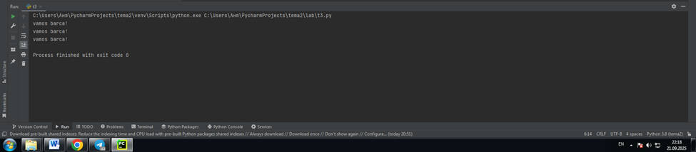
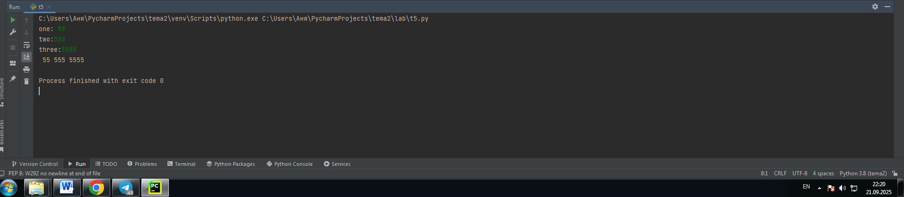
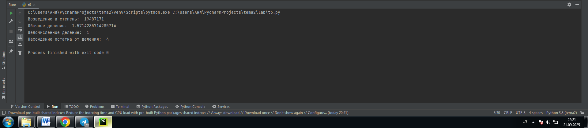
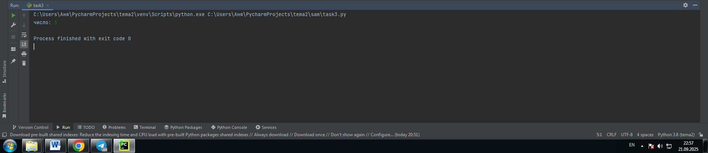

# Тема: Базовые операции языка Python

- Студент: Демшина Анна Александровна
- Группа: ИВТ-23-1

## Таблица выполнения заданий

| Задание   | Лаб_раб | Сам_раб |
|-----------|:-------:|:-------:|
| Задание 1 |    +    |    +    |
| Задание 2 |    +    |    +    |
| Задание 3 |    +    |    +    |
| Задание 4 |    +    |    +    |
| Задание 5 |    +    |    +    |
| Задание 6 |    +    |    +    |
| Задание 7 |    +    |    +    |
| Задание 8 |    +    |    +    |
| Задание 9 |    +    |    +    |
| Задание 10|    +    |    +    |

## Лабораторная работа 2

### Задание 1

 

**Вывод:** Повторила как выводить числа, числа в виде строки и числа с плавающей точкой.

---

### Задание 2

**Вывод:** Получила результат сложения int, float и их комбинации.

---

### Задание 3

**Вывод:** Вывела обычную строку, f-строку с переменной и результат сложения двух строк.

---

### Задание 4

**Вывод:** Повторила преобразованя переменных в bool, int/float и str.

---

### Задание 5

**Вывод:** Ввела три значения через input() и присвоила их переменным.

---

### Задание 6

**Вывод:** Повторила как: возводить в степень, делить, получать целочисленное деление и остаток от деления.

---

### Задание 7

**Вывод:** Умножила строковую переменную на число и получила повторение строки на столько раз, на сколько умножала.

---

### Задание 8

**Вывод:** Посчитала количество символов `o` в строке "welcome back to Trench".

---

### Задание 9

**Вывод:** Вывела строку "I am tired" в две строки, используя одну строку кода.

---

### Задание 10

**Вывод:** Вывела второй символ строки "Hello World" и слово "Hello".

## Самостоятельная работа 2

### Задание 1
**Скриншот результата:**  
  

**Вывод:** Получила False без использования слова `False`.

---

### Задание 2
**Скриншот результата:**  
  

**Вывод:** Присвоила значения трём переменным, используя только две строки редактора кода.

---

### Задание 3
**Скриншот результата:**  
  

**Вывод:** Реализовала ввод только целых чисел через `int(input())`. При вводе буквенных символов в консоль программа не работает.

---

### Задание 4
**Скриншот результата:**  
  

**Вывод:** Создала строку длиной в 5 символов и получила строку длиной 20 символов, умножив строку на 4.

---

### Задание 5
**Скриншот результата:**  
  

**Вывод:** Вывела дату в формате "Сегодня день месяц год. Всего хорошего!" с помощью f-строки.

---

### Задание 6
**Скриншот результата:**  
  

**Вывод:** Вставила "my" в строку "Hello World" между словами.

---

### Задание 7
**Скриншот результата:**  
  

**Вывод:** Определила длину строки "Hello World".

---

### Задание 8
**Скриншот результата:**  
  

**Вывод:** Перевела строку "HELLO WORLD" в нижний регистр.

---

### Задание 9
**Скриншот результата:**  
  

**Вывод:** Задала имя и возраст, и вывела их в предложении.

---

### Задание 10
**Скриншот результата:**  
  

**Вывод:** Посчитала количество букв в заданном слове.
