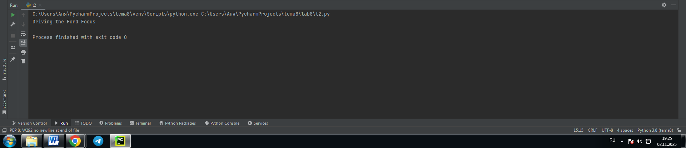
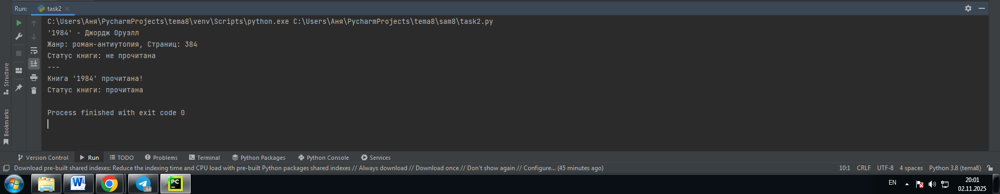
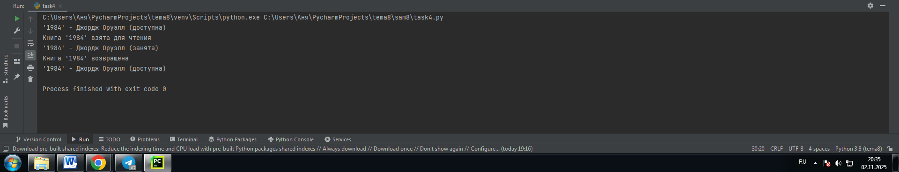

# Тема: Основы объектно-ориентированного программирования

- Студент: Демшина Анна Александровна
- Группа: ИВТ-23-1


## Таблица выполнения заданий

| Задание   | Лаб_раб | Сам_раб |
|-----------|:-------:|:-------:|
| Задание 1 |    +    |    +    |
| Задание 2 |    +    |    +    |
| Задание 3 |    +    |    +    |
| Задание 4 |    +    |    +    |
| Задание 5 |    +    |    +    |


## Лабораторная работа 8

### Задание 1. Создайте класс “Car” с атрибутами производитель и модель. Создайте объект этого класса. Напишите комментарии для кода, объясняющие его работу. Результатом выполнения задания будет листинг кода с комментариями.
```python
# Создание класса Car для представления автомобиля
class Car:
    # Конструктор класса - специальный метод, который вызывается при создании нового объекта
    def __init__(self, make, model):
        # Инициализация атрибутов объекта - производитель и модель
        self.make = make      # Производитель автомобиля
        self.model = model    # Модель автомобиля

# Создание объекта (экземпляра) класса Car с конкретными значениями
my_car = Car("Ford", "Focus")
``` 

**Вывод:** Я разобралась с созданием классов и объектов в Python. Поняла, как работает конструктор __init__ для инициализации атрибутов. Научилась создавать экземпляры класса с конкретными параметрами.

---

### Задание 2.Дополните код из первого задания, добавив в него атрибуты и методы класса, заставьте машину “поехать”. Напишите комментарии для кода, объясняющие его работу. Результатом выполнения задания будет листинг кода с комментариями и получившийся вывод в консоль.

```python
class Car:
    def __init__(self, make, model):
        self.make = make  # Атрибут для производителя автомобиля
        self.model = model  # Атрибут для модели автомобиля

    def drive(self):
        # Метод, который выводит сообщение о движении автомобиля
        print(f"Driving the {self.make} {self.model}")


# Создание объекта класса Car с конкретными параметрами
my_car = Car("Ford", "Focus")

# Вызов метода drive для созданного объекта
my_car.drive()
```
### Результат



**Вывод:** Я научилась добавлять методы в класс. Поняла, как методы взаимодействуют с атрибутами объекта. Разобралась с вызовом методов через точечную нотацию.

---

### Задание 3. Создайте новый класс “ElectricCar” с методом “charge” и атрибутом емкость батареи. Реализуйте его наследование от класса, созданного в первом задании. Заставьте машину поехать, а потом заряжаться. Напишите комментарии для кода, объясняющие его работу. Результатом выполнения задания будет листинг кода с комментариями и получившийся вывод в консоль.

```python
class Car:
    def __init__(self, make, model):
        self.make = make  # Атрибут для производителя автомобиля
        self.model = model  # Атрибут для модели автомобиля

    def drive(self):
        # Метод, который выводит сообщение о движении автомобиля
        print(f"Driving the {self.make} {self.model}")


# Создание объекта класса Car с конкретными параметрами
my_car = Car("Ford", "Focus")

# Вызов метода drive для созданного объекта
my_car.drive()

class ElectricCar(Car):
    def __init__(self, make, model, battery_capacity):
        # Вызов конструктора родительского класса Car
        super().__init__(make, model)
        # Добавление нового атрибута - емкость батареи
        self.battery_capacity = battery_capacity

    def charge(self):
        # Метод для зарядки электромобиля
        print(f"Charging the {self.make} {self.model} with {self.battery_capacity} kWh")

# Создание объекта класса ElectricCar
my_electric_car = ElectricCar("Tesla", "Model S", 75)

# Вызов унаследованного метода drive из класса Car
my_electric_car.drive()

# Вызов метода charge класса ElectricCar
my_electric_car.charge()
```
### Результат


**Вывод:** Я разобралась с наследованием классов в Python. Поняла принцип наследования методов от родительского класса. Научилась расширять функциональность через добавление новых методов.

---

### Задание 4. Реализуйте инкапсуляцию для класса, созданного в первом задании. Создайте защищенный атрибут производителя и приватный атрибут модели. Вызовите защищенный атрибут и заставьте машину поехать. Напишите комментарии для кода, объясняющие его работу. Результатом выполнения задания будет листинг кода с комментариями и получившийся вывод в консоль.

```python
class Car:
    def __init__(self, make, model):
        self._make = make  # Защищенный атрибут
        self.__model = model  # Приватный атрибут

    def drive(self):
        # Метод имеет доступ к защищенным и приватным атрибутам
        print(f"Driving the {self._make} {self.__model}")

# Создание объекта класса Car
my_car = Car("Ford", "Focus")
# Доступ к защищенному атрибуту
print(my_car._make)
# Вызов метода drive (работает с защищенными и приватными атрибутами)
my_car.drive()
```
### Результат


**Вывод:** Я разобралась с инкапсуляцией в Python. Поняла разницу между защищенными и приватными атрибутами. Научилась правильно организовывать доступ к данным класса.

---

### Задание 5. Реализуйте полиморфизм создав основной (общий) класс “Shape”, а также еще два класса “Rectangle” и “Circle”. Внутри последних двух классов реализуйте методы для подсчета площади фигуры. После этого создайте массив с фигурами, поместите туда круг и прямоугольник, затем при помощи цикла выведите их площади. Напишите комментарии для кода, объясняющие его работу. Результатом выполнения задания будет листинг кода с комментариями и получившийся вывод в консоль.

```python
# Основной класс для всех фигур
class Shape:
    def area(self):
        # Общий метод, который будет переопределен в дочерних классах
        pass


# Класс прямоугольника
class Rectangle(Shape):
    def __init__(self, width, height):
        self.width = width
        self.height = height

    def area(self):
        # Метод для расчета площади прямоугольника
        return self.width * self.height


# Класс круга
class Circle(Shape):
    def __init__(self, radius):
        self.radius = radius

    def area(self):
        # Метод для расчета площади круга
        return 3.14 * self.radius * self.radius


# Создание массива с фигурами
shapes = [Rectangle(5, 10), Circle(7)]

# Цикл для вывода площадей фигур
for shape in shapes:
    print(shape.area())
```
### Результат


**Вывод:** Я разобралась с полиморфизмом в Python. Поняла принцип переопределения методов в дочерних классах. Научилась работать с общим интерфейсом для разных объектов.

---

## Самостоятельная работа 8

### Задание 1. Самостоятельно создайте класс и его объект. Они должны отличаться, от тех, что указаны в теоретическом материале (методичке) и лабораторных заданиях. Результатом выполнения задания будет листинг кода и получившийся вывод консоли.
```python
class Book:
    def __init__(self, title, author, pages):
        self.title = title
        self.author = author
        self.pages = pages

    def info(self):
        print(f"Книга: '{self.title}'")
        print(f"Автор: {self.author}")
        print(f"Количество страниц: {self.pages}")


# Создание объекта класса Book
my_book = Book("1984", "Джордж Оруэлл", 384)

# Вызов метода info
my_book.info()
```
### Результат
  

**Вывод:** Я создала класс Book с атрибутами и методом. Поняла процесс создания объектов с конкретными параметрами. Научилась вызывать методы для работы с данными объекта.

---

### Задание 2. Самостоятельно создайте атрибуты и методы для ранее созданного класса. Они должны отличаться, от тех, что указаны в теоретическом материале (методичке) и лабораторных заданиях. Результатом выполнения задания будет листинг кода и получившийся вывод консоли.
```python
class Book:
    def __init__(self, title, author, pages, genre):
        self.title = title
        self.author = author
        self.pages = pages
        self.genre = genre
        self.is_read = False

    def read_book(self):
        self.is_read = True
        print(f"Книга '{self.title}' прочитана!")

    def book_status(self):
        status = "прочитана" if self.is_read else "не прочитана"
        print(f"Статус книги: {status}")

    def full_info(self):
        print(f"'{self.title}' - {self.author}")
        print(f"Жанр: {self.genre}, Страниц: {self.pages}")
        self.book_status()


# Создание объекта и работа с методами
my_book = Book("1984", "Джордж Оруэлл", 384, "роман-антиутопия")
my_book.full_info()
print("---")
my_book.read_book()
my_book.book_status()
```
### Результат
  

**Вывод:** Я добавила новые атрибуты и методы в класс Book. Поняла, как методы могут изменять состояние объекта. Научилась создавать взаимодействие между разными методами класса.

---

### Задание 3. Самостоятельно реализуйте наследование, продолжая работать с ранее созданным классом. Оно должно отличаться, от того, что указано в теоретическом материале (методичке) и лабораторных заданиях. Результатом выполнения задания будет листинг кода и получившийся вывод консоли.
```python
class Book:
    def __init__(self, title, author, pages):
        self.title = title
        self.author = author
        self.pages = pages

    def info(self):
        print(f"Книга: '{self.title}', Автор: {self.author}")


# Класс AudioBook наследуется от Book
class AudioBook(Book):
    def __init__(self, title, author, pages, duration):
        super().__init__(title, author, pages)
        self.duration = duration  # Длительность в часах

    def play(self):
        print(f"Воспроизведение аудиокниги '{self.title}', длительность: {self.duration} часов")


# Создание объекта AudioBook
my_audio = AudioBook("1984", "Джордж Оруэлл", 328, "от 10 до 14")

# Вызов унаследованного метода
my_audio.info()

# Вызов метода класса AudioBook
my_audio.play()
```
### Результат
  

**Вывод:** Я реализовала наследование, создав класс AudioBook. Поняла, как дочерний класс расширяет функциональность родительского. Научилась добавлять новые атрибуты и методы в унаследованный класс.

---

### Задание 4. Самостоятельно реализуйте инкапсуляцию, продолжая работать с ранее созданным классом. Она должна отличаться, от того, что указана в теоретическом материале (методичке) и лабораторных заданиях. Результатом выполнения задания будет листинг кода и получившийся вывод консоли.
```python
class Book:
    def __init__(self, title, author):
        self.title = title
        self.author = author
        self.__is_available = True  # Приватный атрибут доступности

    def borrow_book(self):
        # Метод для взятия книги
        if self.__is_available:
            self.__is_available = False
            print(f"Книга '{self.title}' взята для чтения")
        else:
            print(f"Книга '{self.title}' уже занята")

    def return_book(self):
        # Метод для возврата книги
        self.__is_available = True
        print(f"Книга '{self.title}' возвращена")

    def show_info(self):
        # Вывод информации о книге и ее доступности
        status = "доступна" if self.__is_available else "занята"
        print(f"'{self.title}' - {self.author} ({status})")


# Создание объекта
my_book = Book("1984", "Джордж Оруэлл")

# Работа с методами
my_book.show_info()
my_book.borrow_book()
my_book.show_info()
my_book.return_book()
my_book.show_info()
```
### Результат
  

**Вывод:** Я создала систему учета доступности книг. Поняла, как приватный атрибут скрывает внутреннее состояние. Научилась выводить информацию о статусе объекта.

---

### Задание 5. Самостоятельно реализуйте полиморфизм. Он должен отличаться, от того, что указан в теоретическом материале (методичке) и лабораторных заданиях. Результатом выполнения задания будет листинг кода и получившийся вывод консоли.
```python
class Transport:
    def move(self):
        pass

class Car(Transport):
    def move(self):
        print("Машина едет по дороге")

class Airplane(Transport):
    def move(self):
        print("Самолет летит в небе")

class Ship(Transport):
    def move(self):
        print("Корабль плывет по морю")

# Разные виды транспорта
transports = [Car(), Airplane(), Ship()]

# Каждый транспорт движется по-своему
for transport in transports:
    transport.move()
```
### Результат
  

**Вывод:** Я реализовала полиморфизм с разными видами транспорта. Поняла, как один метод работает по-разному. Научилась создавать простые и понятные классы.

---

## Общие выводы по теме
**Освоив основы объектно-ориентированного программирования, я научилась создавать классы и объекты, добавлять атрибуты и методы. Практикуясь с наследованием, инкапсуляцией и полиморфизмом, я поняла, как эти принципы помогают создавать структурированные программы. Работа с ООП показала мне, как организовывать код для решения сложных задач простыми способами.**
