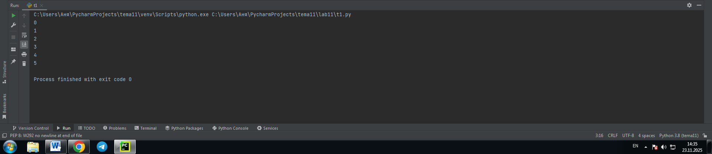
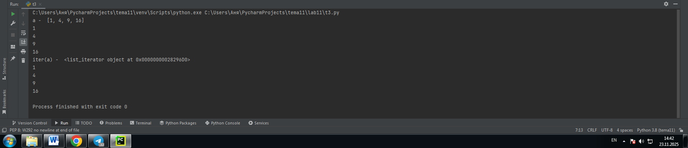
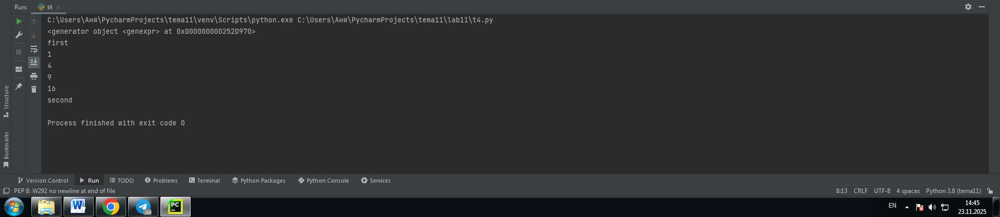
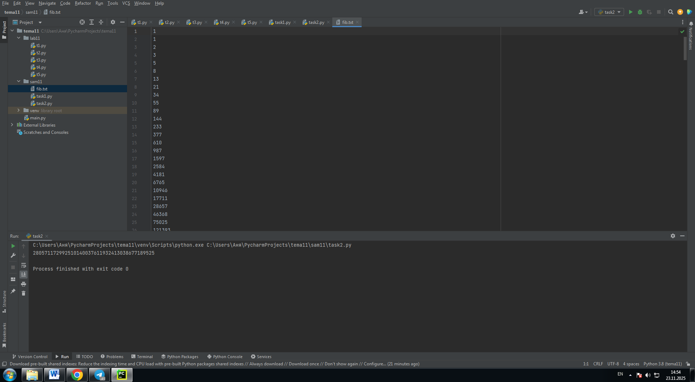

# Тема: Итераторы и генераторы

- Студент: Демшина Анна Александровна
- Группа: ИВТ-23-1


## Таблица выполнения заданий

| Задание   | Лаб_раб | Сам_раб |
|-----------|:-------:|:-------:|
| Задание 1 |    +    |    +    |
| Задание 2 |    +    |    +    |
| Задание 3 |    +    |         |
| Задание 4 |    +    |         |
| Задание 5 |    +    |         |


## Лабораторная работа 11

### Задание 1. Простой итератор, но у него нет гибкой настройки, например его нельзя развернуть. Он работает просто как next(), но нет prev().

```python
numbers = [0, 1, 2, 3, 4, 5]
for item in numbers:
    print(item)
``` 
### Результат

 

**Вывод:** Выполняя задание, я поняла ограничения базовой итерации и необходимость создания более гибких решений.

---

### Задание 2. Класс итератор с гибкой настройкой и удобными применением.

```python
class CountDown:
    def __init__(self, start):
        self.count = start + 1
    def __iter__(self):
        return self
    def __next__(self):
        self.count -= 1
        if self.count < 0:
            raise StopIteration
        return self.count

if __name__ == '__main__':
    counter = CountDown(5)
    for i in counter:
        print(i)
```
### Результат


**Вывод:** Я разобралась как создавать классы-итераторы с методами __iter__ и __next__. Научилась реализовывать обратный отсчет через итератор.

---

### Задание 3. Генератор списка.

```python
a = [i ** 2 for i in range(1, 5)]
print('a - ', a)
for i in a:
    print(i)
print('iter(a) - ', iter(a))
for i in a:
    print(i)
```
### Результат


**Вывод:** Выполняя задание, я поняла разницу между генератором списка и функцией iter().

---

### Задание 4. Выражения генераторы.

```python
b = (i ** 2 for i in range(1, 5))
print(b)
print('first')
for i in b:
    print(i)
print('second')
for i in b:
    print(i)
```
### Результат



**Вывод:** Я разобралась как создавать выражения-генераторы.

---

### Задание 5. Такой же счетчик, как и в первом задании, только это генератор и использует yield.
```python
def countdown(count):
    while count >= 0:
        yield count
        count -= 1

if __name__ == '__main__':
    counter = countdown(5)
    for i in counter:
        print(i)
```
### Результат


**Вывод:** Я разобралась как создавать функции-генераторы с помощью yield. Научилась использовать yield для создания последовательностей.

---

## Самостоятельная работа 11

### Задание 1. Создайте функцию fib(n), генерирующую n чисел Фибоначчи с минимальными затратами ресурсов. Для реализации этой функции потребуется обратиться к инструкции yield (Она не сохраняет в оперативной памяти огромную последовательность, а дает возможность “доставать” промежуточные результаты по одному). Результатом решения задачи будет листинг кода и вывод в консоль с числом Фибоначчи от 200.
```python
def fib(n):
    a, b = 1, 1
    count = 0
    while count < n:
        yield a
        a, b = b, a + b
        count += 1

if __name__ == '__main__':
    n = 200
    fib_gen = fib(n)
    result = None
    for num in fib_gen:
        result = num
    print(result)
```
### Результат
  

**Вывод:** Я научилась создавать генераторы для вычисления чисел Фибоначчи. Разобралась с использованием yield для эффективного расходования памяти.

---

### Задание 2. К коду предыдущей задачи добавьте запоминание каждого числа Фибоначчи в файл “fib.txt”, при этом каждое число должно находиться на отдельной строчке. Результатом выполнения задачи будет листинг кода и скриншот получившегося файла.
```python
def fib(n):
    a, b = 1, 1
    count = 0
    while count < n:
        yield a
        a, b = b, a + b
        count += 1


if __name__ == '__main__':
    n = 200
    fib_gen = fib(n)

    with open('fib.txt', 'w', encoding='utf-8') as file:
        for num in fib_gen:
            file.write(str(num) + '\n')

    fib_gen = fib(n)
    result = None
    for num in fib_gen:
        result = num
    print(result)
```
### Результат
  

**Вывод:** Я научилась сохранять результаты работы генератора в файл. Разобралась с записью данных построчно.

---

## Общие выводы по теме
**Изучив итераторы и генераторы, я научилась создавать способы обработки данных. Освоила простые итераторы, классы-итераторы и генераторы списков. На практике убедилась в преимуществах генераторов с yield для работы с большими последовательностями.**
