# Тема: Базовые коллекции: строки и списки

- Студент: Демшина Анна Александровна
- Группа: ИВТ-23-1


## Таблица выполнения заданий

| Задание   | Лаб_раб | Сам_раб |
|-----------|:-------:|:-------:|
| Задание 1 |    +    |    +    |
| Задание 2 |    +    |    +    |
| Задание 3 |    +    |    +    |
| Задание 4 |    +    |    +    |
| Задание 5 |    +    |    +    |
| Задание 6 |    +    |         |
| Задание 7 |    +    |         |
| Задание 8 |    +    |         |
| Задание 9 |    +    |         |
| Задание 10|    +    |         |


## Лабораторная работа 5

### Задание 1. Друзья предложили вам поиграть в игру “найди отличия и убери повторения (версия для программистов)”. Суть игры состоит в том, что на вход программы поступает два множества, а ваша задача вывести все элементы первого, которых нет во втором.

```python
set_1 = {'White','Black','Red','Pink'}
set_2 = {'Red','Green','Blue','Red'}
print('1',set_1 - set_2)

set_1 = {'White','Black','Red','Pink','Black','White'}
set_2 = {'Red','Green','Blue','Red'}
print('2',set_1 - set_2)

set_1 = {'White','Black','Red','Pink','Red','Red'}
set_2 = {'Red','Green','Red','Red','Red'}
print('3',set_1 - set_2)
``` 
### Результат
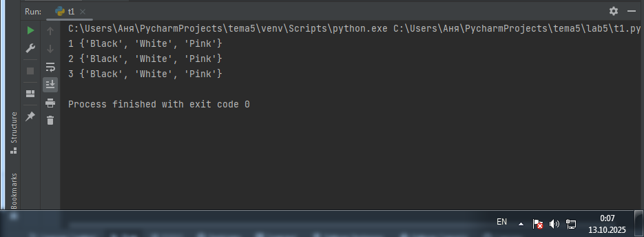
 

**Вывод:** Я научилась использовать операцию вычитания множеств, чтобы находить элементы, уникальные для первого множества.

---

### Задание 2. Напишите две одинаковые программы, только одна будет использовать set(), а вторая frozenset() и попробуйте к исходному множеству добавить несколько элементов, например, через цикл.

```python
print("Set():")
a = set('abcdefg')
print(a)

for i in range(1, 5):
    a.add(i)
    print(a)

print("\nFrozenset():")
b = frozenset('abcdefg')
print(b)

try:
    for i in range(1, 5):
        b.add(i)
        print(b)
except AttributeError as e:
    print(f"Ошибка: {e}")
```
### Результат
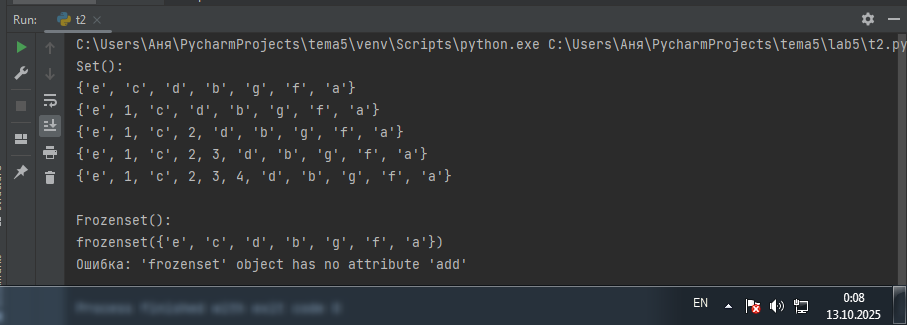


**Вывод:** Выполняя это задание, я научилась разделять операции с изменяемыми (set) и неизменяемыми (frozenset) множествами, осознав, что метод .add() работает только для set.

---

### Задание 3. На вход в программу поступает список (минимальной длиной 2 символа). Напишите программу, которая будет менять первый и последний элемент списка.

```python
def replace(input_list):
    memory = input_list[0]
    input_list[0] = input_list[-1]
    input_list[-1] = memory

    return input_list
print(replace([1,2,3,4,5]))
```
### Результат
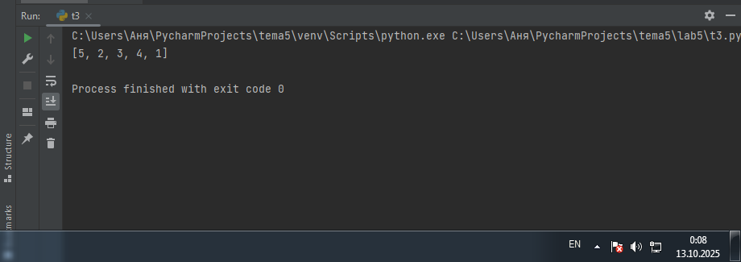

**Вывод:** Я научилась создавать функцию, которая меняет местами первый и последний элементы списка, используя временную переменную для хранения значения.

---

### Задание 4. На вход в программу поступает список (минимальной длиной 10 символов). Напишите программу, которая выводит элементы с индексами от 2 до 6. В программе необходимо использовать “срез”.

```python
a = [12, 54, 32, 57, 843, 2346, 765, 75, 25, 234, 756, 23]
print(a[2:6])
```
### Результат

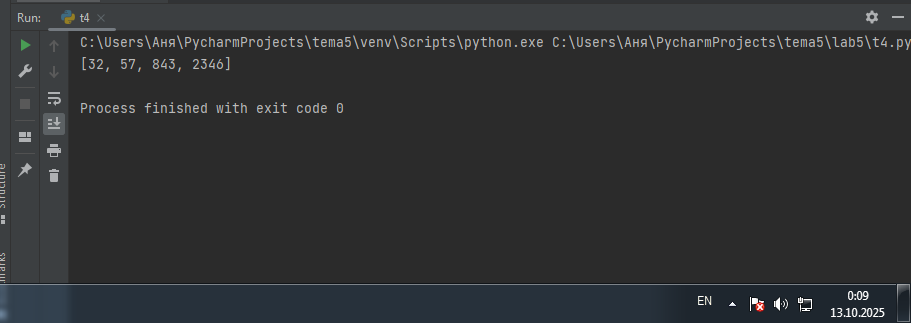

**Вывод:** Я научилась использовать срезы списка для вывода определенного диапазона элементов.

---

### Задание 5. Иван задумался о поиске «бесполезного» числа, полученного из списка. Суть поиска в следующем: он берет произвольный список чисел, находит самое большое из них, а затем делит его на длину списка. Студент пока не придумал, где может пригодиться подобное значение, но ищет у вас помощи в реализации такой функции useless().

```python
def useless(lst):
    return max(lst) / len(lst)
print(useless([3,5,7,3,33]))
print(useless([-12.5,54,77.3,0,-36,98.2,-63,21.7,47,-89.6]))
print(useless([-25.8,86,12.5,-56,73.2,0,43,-91.5,65.9,-7]))
```
### Результат

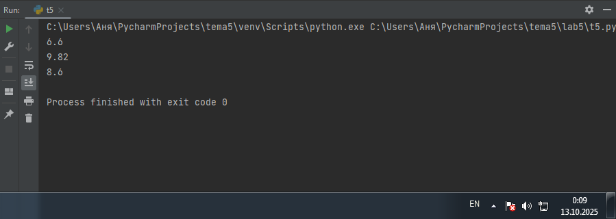

**Вывод:** Я научилась создавать и применять функцию, которая вычисляет отношение максимального элемента списка к общей длине этого списка.

---

### Задание 6. Ребята не могут определится каким супергероем они хотят стать. У них есть случайно составленный список супергероев, и вы должны определить кто из ребят будет каким супергероем. Необходимо использовать разделение списков.

```python
superheroes = ['superman', 'spiderman', 'batman']
nikolay, vasiliy, ivan = superheroes

print('Николай -', nikolay)
print('Василий -', vasiliy)
print('Иван -', ivan)
```
### Результат

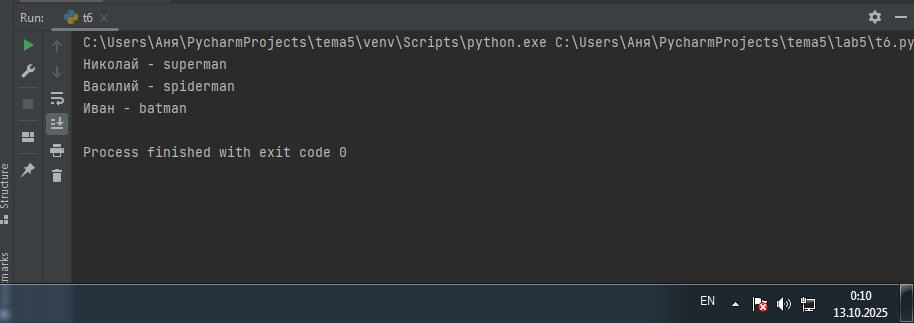

**Вывод:** Я научилась использовать распаковку списка для быстрого присвоения элементов списка отдельным переменным.

---

### Задание 7. Вовочка, насмотревшись передачи “Слабое звено” решил написать программу, которая также будет находить самое слабое звено (минимальный элемент) и удалять его, только делать он это хочет не с людьми, а со списком. Помогите Вовочке с реализацией программы.
```python
a = [-25.8, 86, 12.5, -56, 73.2, 0, 43, -91.5, 65.9, -7]
a.sort()
print('Отсортированный список: \n', a)
a.pop(0)
print('Отсортированный список без наименьшего элемента: \n', a)
```
### Результат
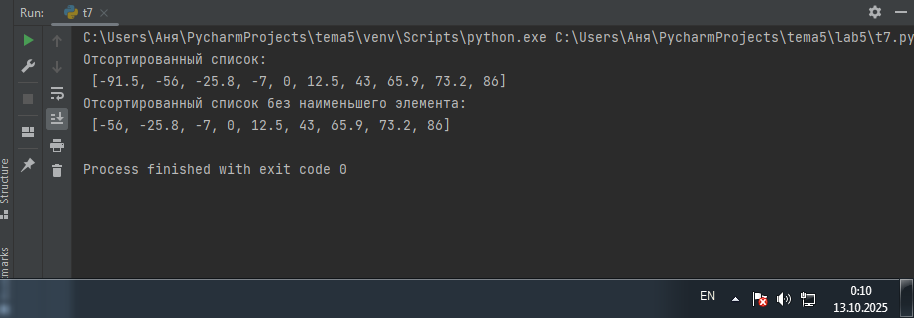

**Вывод:** Я научилась сортировать список чисел методом .sort(), а затем удалять наименьший элемент(который находится на нулевой позиции после сортировки) методом .pop(0).

---

### Задание 8. Михаил решил создать большой n-мерный список, для этого он случайным образом создал несколько списков, состоящих минимум из 3, а максимум из 10 элементов и поместил их в один большой список. Он также как и Иван не знает зачем ему это сейчас нужно, но надеется на то, что это пригодится ему в будущем.
```python
from random import randint
def list_maker():
    a = [randint(1, 100)] * randint(3,10)
    return a

if __name__ == '__main__':
    result = []
    for i in range(randint(1, 5)):
        result.append(list_maker())
    print(result)
```
### Результат
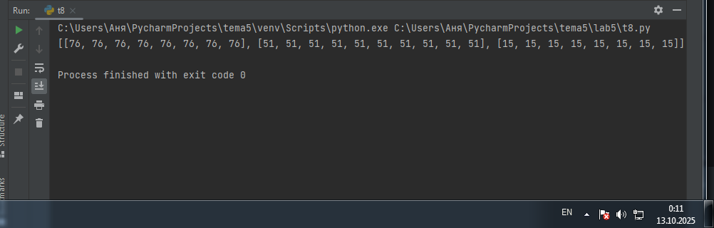

**Вывод:** Я научилась создавать списки случайной длины, заполненные повторяющимся случайным числом, используя функции randint и умножение списка.

---

### Задание 9. Вы работаете в ресторане и отвечает за статистику покупок, ваша задача сравнить между собой заказы покупателей, которые указаны в разном порядке. Реализуйте функцию superset(), которая принимает 2 множества. Результат работы функции: вывод в консоль одного из сообщений в зависимости от ситуации: 1 - «Супермножество не обнаружено» 2 – «Объект {X} является чистым супермножеством» 3 – «Множества равны».
```python
def superset(set_1, set_2):
    set_1 = set(set_1)
    set_2 = set(set_2)

    if set_1 > set_2:
        print(f'Объект {set_1} является чистым супермножеством')
    elif set_1 == set_2:
        print('Множества равны')
    elif set_1 < set_2:
        print(f'Объект {set_2} является чистым супермножеством')
    else:
        print('Супермножество не обнаружено')

superset([1, 8, 3, 5], {5, 3})
superset([1, 8, 3, 5], {5, 3, 8, 1})
superset([5, 3], {5, 3, 8, 1})
superset([90, 100], {3, 5})
```
### Результат
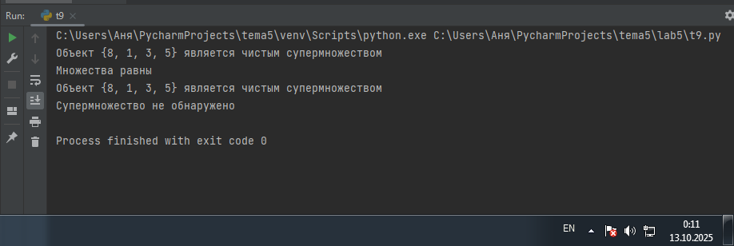

**Вывод:** Я научилась использовать операторы сравнения для проверки отношений между множествами.

---

### Задание 10. Предположим, что вам нужно разобрать стопку бумаг, но нужно начать работу с нижней, “переверните стопку”. Вам дан произвольный список. Представьте его в обратном порядке. Программа должна занимать не более двух строк в редакторе кода.
```python
my_list = [2, 5, 8, 3]
print(my_list[::-1])
```
### Результат

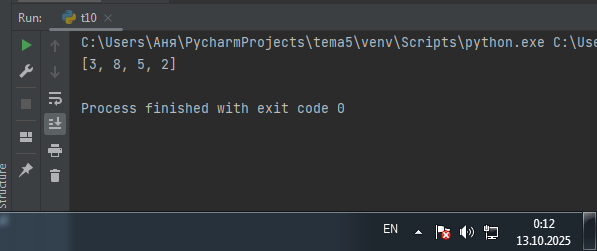

**Вывод:** Я научилась использовать срез [::-1] для быстрого разворота списка в обратном порядке.

## Самостоятельная работа 5

### Задание 1. ) Ресторан на предприятии ведет учет посещений за неделю при помощи кода работника. У них есть список со всеми посещениями за неделю. Ваша задача почитать: • Сколько было выдано чеков • Сколько разных людей посетило ресторан • Какой работник посетил ресторан больше всех раз Список выданных чеков за неделю: [8734, 2345, 8201, 6621, 9999, 1234, 5678, 8201, 8888, 4321, 3365, 1478, 9865, 5555, 7777, 9998, 1111, 2222, 3333, 4444, 5556, 6666, 5410, 7778, 8889, 4445, 1439, 9604, 8201, 3365, 7502, 3016, 4928, 5837, 8201, 2643, 5017, 9682, 8530, 3250, 7193, 9051, 4506, 1987, 3365, 5410, 7168, 7777, 9865, 5678, 8201, 4445, 3016, 4506, 4506] Результатом выполнения задачи будет: листинг кода, и вывод в консоль, в котором будет указана вся необходимая информация.
```python
from collections import Counter

checks = [8734, 2345, 8201, 6621, 9999, 1234, 5678, 8201, 8888, 4321, 3365,
          1478, 9865, 5555, 7777, 9998, 1111, 2222, 3333, 4444, 5556, 6666,
          5410, 7778, 8889, 4445, 1439, 9604, 8201, 3365, 7502, 3016, 4928,
          5837, 8201, 2643, 5017, 9682, 8530, 3250, 7193, 9051, 4506, 1987,
          3365, 5410, 7168, 7777, 9865, 5678, 8201, 4445, 3016, 4506, 4506]

total_checks = len(checks)
unique_visitors = len(set(checks))

visitor_counts = Counter(checks)
most_frequent_visitor, max_visits = visitor_counts.most_common(1)[0]

print(f"Всего выдано чеков: {total_checks}")
print(f"Разных людей посетило ресторан: {unique_visitors}")
print(f"Работник {most_frequent_visitor} посетил ресторан чаще всех - {max_visits} раз(а)")
```
### Результат
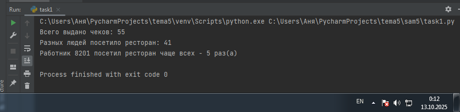  

**Вывод:** Я научилась использовать класс Counter из модуля collections для быстрого подсчёта частоты элементов и определения самого частого посетителя в списке.

---

### Задание 2. На физкультуре студенты сдавали бег, у преподавателя физкультуры есть список всех результатов, ему нужно узнать • Три лучшие результата • Три худшие результата • Все результаты начиная с 10 Ваша задача помочь ему в этом. Список результатов бега: [10.2, 14.8, 19.3, 22.7, 12.5, 33.1, 38.9, 21.6, 26.4, 17.1, 30.2, 35.7, 16.9, 27.8, 24.5, 16.3, 18.7, 31.9, 12.9, 37.4] Результатом выполнения задачи будет: листинг кода, и вывод в консоль, в котором будет указана вся необходимая информация.
```python
results = [10.2, 14.8, 19.3, 22.7, 12.5, 33.1, 36.9, 21.0, 26.4, 17.1,
           30.2, 35.7, 16.9, 27.8, 24.5, 16.3, 18.7, 31.9, 12.9, 37.4]

sorted_results = sorted(results)

best_results = sorted_results[:3]
worst_results = sorted_results[-3:]

results_from_10 = [r for r in sorted_results if r >= 10]

print(f"Три лучшие результата: {best_results}")
print(f"Три худшие результата: {worst_results}")
print(f"Все результаты начиная с 10 секунд: {results_from_10}")
```
### Результат
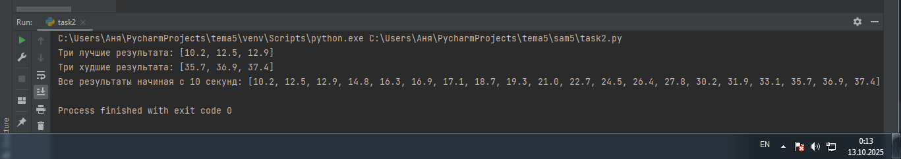  

**Вывод:** Я научилась сортировать список с помощью sorted(), извлекать лучшие и худшие результаты с помощью срезов ([:3] и [-3:]), а также фильтровать список с помощью генератора списка ([r for r in ... if ...]).

---

### Задание 3. Преподаватель по математике придумал странную задачку. У вас есть три списка с элементами, каждый элемент которых – длина стороны треугольника, ваша задача найти площади двух треугольников, составленные из максимальных и минимальных элементов полученных списков. Результатом выполнения задачи будет: листинг кода, и вывод в консоль, в котором будут указаны два этих значения. Три списка: one = [12, 25, 3, 48, 71], two = [5, 18, 40, 62, 98], three = [4, 21, 37, 56, 84]
```python
import math

one = [12, 25, 3, 48, 71]
two = [5, 18, 40, 62, 98]
three = [4, 21, 37, 56, 84]

all_elements = one + two + three

min_elements = sorted(all_elements)[:3]
max_elements = sorted(all_elements)[-3:] 

def triangle_area(a, b, c):
    p = (a + b + c) / 2
    return math.sqrt(p * (p - a) * (p - b) * (p - c))

area_min = triangle_area(min_elements[0], min_elements[1], min_elements[2])
area_max = triangle_area(max_elements[0], max_elements[1], max_elements[2])

print(f"Минимальные элементы: {min_elements}")
print(f"Максимальные элементы: {max_elements}")
print(f"Площадь треугольника из минимальных элементов: {area_min:.2f}")
print(f"Площадь треугольника из максимальных элементов: {area_max:.2f}")
```
### Результат
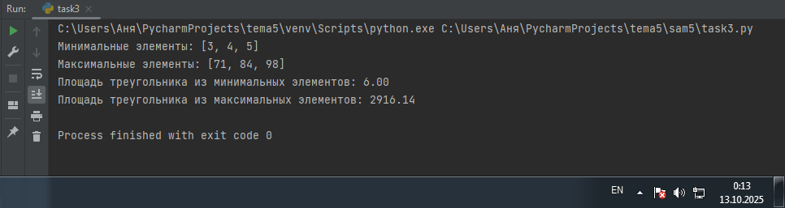  

**Вывод:** Я научилась объединять несколько списков, использовать функцию sorted() со срезами для выбора трех минимальных и трех максимальных элементов, а затем применять формулу Герона для вычисления площади треугольника.

---

### Задание 4. Никто не любит получать плохие оценки, поэтому Борис решил это исправить. Допустим, что все оценки студента за семестр хранятся в одном списке. Ваша задача удалить из этого списка все двойки, а все тройки заменить на четверки. Списки оценок (проверить работу программы на всех трех вариантах): [2, 3, 4, 5, 3, 4, 5, 2, 2, 5, 3, 4, 3, 5, 4] [4, 2, 3, 5, 3, 5, 4, 2, 2, 5, 4, 3, 5, 3, 4] [5, 4, 3, 3, 4, 3, 3, 5, 5, 3, 3, 3, 3, 4, 4] Результатом выполнения задачи будет: листинг кода, и вывод в консоль, в котором будут три обновленных массива
```python
def fix_grades(grades):
    fixed_grades = []
    for grade in grades:
        if grade == 2:
            continue
        elif grade == 3:
            fixed_grades.append(4)
        else:
            fixed_grades.append(grade)
    return fixed_grades

grades_list_1 = [2, 3, 4, 5, 3, 4, 2, 2, 5, 3, 4, 3, 5, 4]
grades_list_2 = [4, 2, 3, 5, 3, 5, 4, 2, 2, 5, 4, 3, 3, 4]
grades_list_3 = [5, 4, 3, 3, 4, 5, 5, 5, 3, 3, 3, 5, 4, 4]

fixed_1 = fix_grades(grades_list_1)
fixed_2 = fix_grades(grades_list_2)
fixed_3 = fix_grades(grades_list_3)

print(f"Исходные оценки 1: {grades_list_1}")
print(f"Исправленные оценки 1: {fixed_1}")
print(f"Исходные оценки 2: {grades_list_2}")
print(f"Исправленные оценки 2: {fixed_2}")
print(f"Исходные оценки 3: {grades_list_3}")
print(f"Исправленные оценки 3: {fixed_3}")
```
### Результат
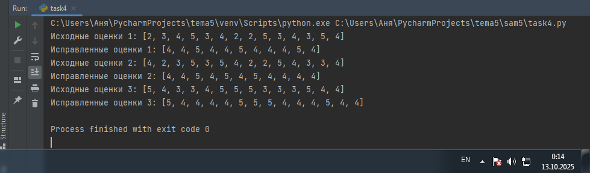  

**Вывод:** Я научилась обрабатывать элементы списка с помощью условного цикла, используя continueдля пропуска двоек и заменяя тройки на четверки, чтобы создать новый исправленный список оценок.

---

### Задание 5. Вам предоставлены списки натуральных чисел, из них необходимо сформировать множества. При этом следует соблюдать это правило: если какое-либо число повторяется, то преобразовать его в строку по следующему образцу: например, если число 4 повторяется 3 раза, то в множестве будет следующая запись: само число 4, строка «44», строка «444». Множества для теста: list_1 = [1, 1, 3, 3, 1] list_2 = [5, 5, 5, 5, 5, 5, 5] list_3 = [2, 2, 1, 2, 2, 5, 6, 7, 1, 3, 2, 2]
```python
def create_special_set(numbers):
    result_set = set()
    from collections import Counter
    counts = Counter(numbers)

    for num, count in counts.items():
        result_set.add(num)
        for i in range(2, count + 1):
            result_set.add(str(num) * i)

    return result_set

list_1 = [1, 1, 3, 3, 1]
list_2 = [5, 5, 5, 5, 5, 5, 5, 5]
list_3 = [2, 2, 1, 2, 2, 5, 6, 7, 1, 3, 2, 2]

set_1 = create_special_set(list_1)
set_2 = create_special_set(list_2)
set_3 = create_special_set(list_3)

print(f"Множество 1: {set_1}")
print(f"Множество 2: {set_2}")
print(f"Множество 3: {set_3}")
```
### Результат
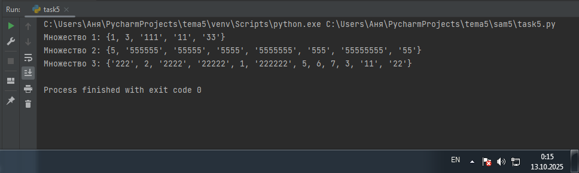  

**Вывод:** Я научилась создавать множества, которые включают исходные числа и их строковое представление, повторяющееся от двух раз до их частоты, используя при этом Counter для подсчета.

---

## Общие выводы по теме
**Я научилась эффективно работать с основными типами данных в Python: списками, множествами и словарями. Освоила, как сортировать, фильтровать и менять элементы в списках с помощью срезов. Я узнала, как быстро считать и сравнивать элементы в больших наборах данных, используя такие инструменты, как Counter.**
