# Тема: Работа с файлами (ввод, вывод)

- Студент: Демшина Анна Александровна
- Группа: ИВТ-23-1


## Таблица выполнения заданий

| Задание   | Лаб_раб | Сам_раб |
|-----------|:-------:|:-------:|
| Задание 1 |    +    |    +    |
| Задание 2 |    +    |    +    |
| Задание 3 |    +    |    +    |
| Задание 4 |    +    |    +    |
| Задание 5 |    +    |    +    |
| Задание 6 |    +    |         |
| Задание 7 |    +    |         |
| Задание 8 |    +    |         |
| Задание 9 |    +    |         |
| Задание 10|    +    |         |


## Лабораторная работа 7

### Задание 1. Составьте текстовый файл и положите его в одну директорию с программой на Python. Текстовый файл должен состоять минимум из двух строк.


### Результат
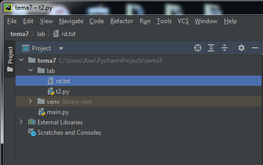
 

**Вывод:** Создала текстовый файл, положила его в одну директорию с программой

---

### Задание 2. Напишите программу, которая выведет только первую строку из вашего файла, при этом используйте конструкцию open()/close().

```python
f = open('rd.txt', 'r')
print(f.readline())
f.close()
```
### Результат
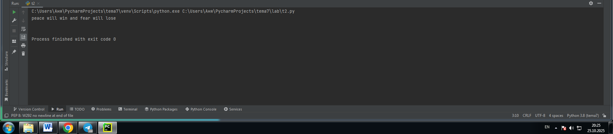


**Вывод:** Я разобралась, как работает чтение файлов в Python: открытие файла с помощью open(), чтение первой строки методом readline() и обязательное закрытие файла с помощью close().

---

### Задание 3. Напишите программу, которая выведет все строки из вашего файла в массиве, при этом используйте конструкцию open()/close().
```python
f = open('rd.txt', 'r')
print(f.readlines())
f.close()
```
### Результат
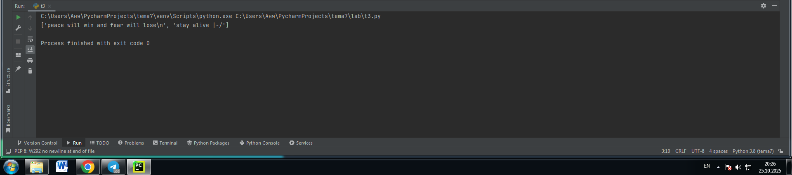

**Вывод:** Я разобралась, как работает чтение всех строк файла: метод readlines() возвращает список строк, который можно обрабатывать в программе.

---

### Задание 4. Напишите программу, которая выведет все строки из вашего файла в массиве, при этом используйте конструкцию with open().

```python
with open('rd.txt') as f:
    print(f.readlines())
```
### Результат

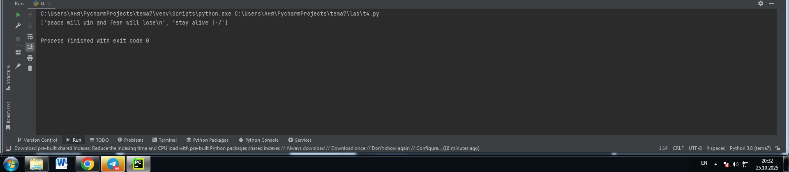

**Вывод:** Я разобралась, как работает конструкция with open() - она автоматически закрывает файл после работы, что удобнее и безопаснее ручного вызова close().

---

### Задание 5. Напишите программу, которая выведет каждую строку из вашего файла отдельно, при этом используйте конструкцию with open().

```python
with open('rd.txt') as f:
    for line in f:
        print(line)
```
### Результат


**Вывод:** Я разобралась, как работает построчное чтение файла через итерацию - цикл for line in f позволяет обрабатывать файл построчно, что экономит память при работе с большими файлами.

---

### Задание 6. Напишите программу, которая будет добавлять новую строку в ваш файл, а потом выведет полученный файл в консоль. Вывод можно осуществлять любым способом. Обязательно проверьте сам файл, чтобы изменения в нем тоже отображались.

```python
with open('rd.txt','a+') as f:
    f.write('\nIm additional line')

with open('rd.txt', 'r') as f:
    result =f.readlines()
    print(result)
```
### Результат

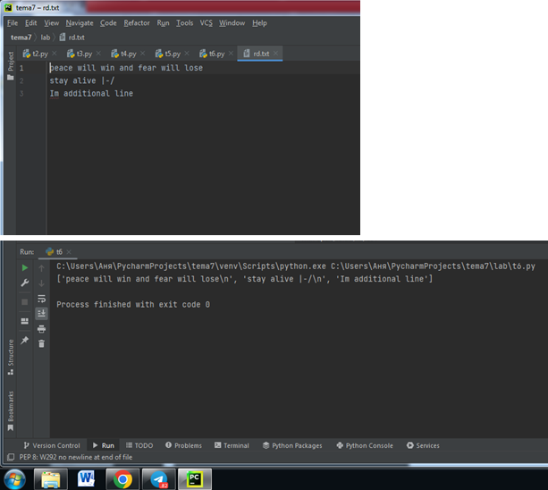

**Вывод:** Я разобралась, как работает режим 'a+' для записи в файл - он позволяет дописывать данные в конец файла и при необходимости читать его, при этом существующие данные не удаляются.

---

### Задание 7. Напишите программу, которая перепишет всю информацию, которая была у вас в файле до этого, например напишет любые данные из произвольно вами составленного списка. Также не забудьте проверить что измененная вами информация сохранилась в файле.
```python
lines = ['one','two','three']
with open('rd.txt', 'w') as f:
    for line in lines:
        f.write('\nCycle run' +line)
    print('Done!')    
```
### Результат


**Вывод:** Я разобралась, как работает запись списка в файл через цикл - режим 'w' создает новый файл или перезаписывает существующий, а метод write() записывает каждую строку из списка.

---

### Задание 8. Выберите любую папку на своем компьютере, имеющую вложенные директории. Выведите на печать в терминал ее содержимое, как и всех подкаталогов при помощи функции print_docs(directory).
```python
import os


def print_docs(directory):
    all_files = os.walk(directory)
    for catalog in all_files:
        print(f'Папка {catalog[0]} содержит:')
    print(f'Директории: {", ".join([folder for folder in catalog[1]])}')
    print(f'Файлы: {",".join([file for file in catalog[2]])}')
    print('-' * 40)

print_docs('C:/Users/Аня/PycharmProjects/tema4/sam4')
```
### Результат
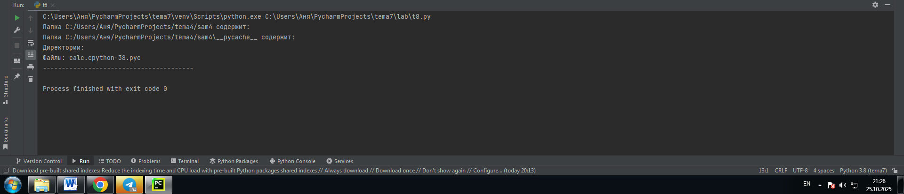

**Вывод:** Поняла принцип работы os.walk(): функция генерирует структуру каталогов, позволяя получить информацию о всех вложенных папках и файлах в указанной директории.

---

### Задание 9. Требуется реализовать функцию, которая выводит слово, имеющее максимальную длину (или список слов, если таковых несколько). Проверьте работоспособность программы на своем наборе данных
```python
def longest_words(file):
    with open(file, encoding='utf-8') as f:
        words = f.read().split()
        max_length = len(max(words, key=len))
        for word in words:
            if len(word) == max_length:
                sought_words = word

        if len(sought_words) == 1:
            return sought_words[0]
        return sought_words

print(longest_words('dr.txt'))
```
### Результат
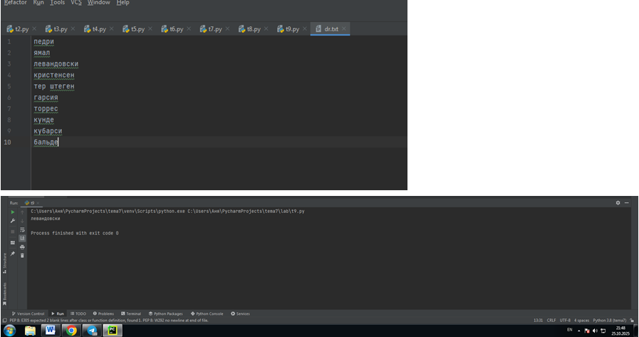

**Вывод:** Я разобралась, как найти самое длинное слово в файле: чтение с указанием кодировки, разбиение текста на слова и поиск максимальной длины с помощью key=len в функции max().

---

### Задание 10. Требуется создать csv-файл «rows_300.csv» со следующими столбцами: • № - номер по порядку (от 1 до 300); Секунда – текущая секунда на вашем ПК; • Микросекунда – текущая миллисекунда на часах. Для наглядности на каждой итерации цикла искусственно приостанавливайте скрипт на 0,01 секунды.
```python
import csv
import datetime
import time

with open('d.csv', 'w',encoding='utf-8',newline='') as f:
    writer = csv.writer(f)
    writer.writerow(['№','Секунда','Микросекунда'])
    for line in range(1,301):
        writer.writerow([line, datetime.datetime.now().second,
                         datetime.datetime.now().microsecond])
        time.sleep(0.01)
```
### Результат

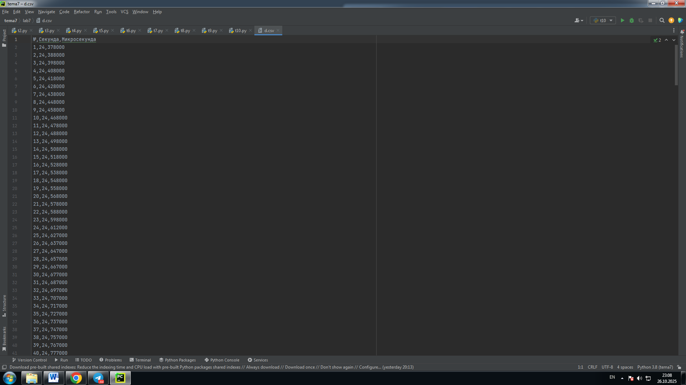

**Вывод:** Я поняла, как работать с CSV-файлами в Python: создание файла с кодировкой utf-8, запись заголовков и данных с помощью csv.writer, а также добавление задержки между записями.

## Самостоятельная работа 7

### Задание 1. Найдите в интернете любую статью (объем статьи не менее 200 слов), скопируйте ее содержимое в файл и напишите программу, которая считает количество слов в текстовом файле и определит самое часто встречающееся слово. Результатом выполнения задачи будет: скриншот файла со статьей, листинг кода, и вывод в консоль, в котором будет указана вся необходимая информация.
```python
from collections import Counter


def analyze_text(file_path):
    with open(file_path, 'r', encoding='utf-8') as file:
        text = file.read()

    words = text.lower().split()
    words = [word.strip('.,!?;:"()[]') for word in words if word.strip('.,!?;:"()[]')]

    total_words = len(words)

    word_counts = Counter(words)
    most_common_word, most_common_count = word_counts.most_common(1)[0]

    print(f"Общее количество слов в тексте: {total_words}")
    print(f"Самое частое слово: '{most_common_word}'")
    print(f"Количество повторений: {most_common_count}")

analyze_text('article.txt')
```
### Результат
  

**Вывод:** Я изучила, как анализировать текстовые файлы: чтение содержимого, очистка слов от знаков препинания, подсчет общего количества слов и поиск наиболее частых слов с помощью Counter из модуля collections.

---

### Задание 2. У вас появилась потребность в ведении книги расходов, посмотрев все существующие варианты вы пришли к выводу что вас ничего не устраивает и нужно все делать самому. Напишите программу для учета расходов. Программа должна позволять вводить информацию о расходах, сохранять ее в файл и выводить существующие данные в консоль. Ввод информации происходит через консоль. Результатом выполнения задачи будет: скриншот файла с учетом расходов, листинг кода, и вывод в консоль, с демонстрацией работоспособности программы.
```python
def add_expense():
    category = input("Введите категорию расхода: ")
    amount = input("Введите сумму: ")
    description = input("Введите описание: ")

    with open('expenses.txt', 'a', encoding='utf-8') as f:
        f.write(f"{category}|{amount}|{description}\n")
    print("Расход добавлен!")


def show_expenses():
    try:
        with open('expenses.txt', 'r', encoding='utf-8') as f:
            expenses = f.readlines()

        if not expenses:
            print("Нет записей о расходах.")
            return

        total = 0
        print("\nВСЕ РАСХОДЫ:")
        print("-" * 30)
        for line in expenses:
            category, amount, description = line.strip().split('|')
            print(f"Категория: {category}")
            print(f"Сумма: {amount} руб.")
            print(f"Описание: {description}")
            print("-" * 20)
            total += float(amount)

        print(f"ОБЩАЯ СУММА: {total} руб.")

    except FileNotFoundError:
        print("Файл с расходами не найден.")

while True:
    print("\n1 - Добавить расход")
    print("2 - Показать расходы")
    print("3 - Выход")

    choice = input("Выберите действие: ")

    if choice == '1':
        add_expense()
    elif choice == '2':
        show_expenses()
    elif choice == '3':
        print("Выход из программы")
        break
    else:
        print("Неверный выбор")
```
### Результат
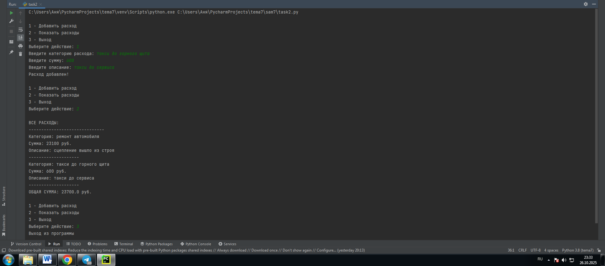  

**Вывод:** Я разобралась с созданием простой системы учета: использование текстового файла для хранения данных, разделитель | для полей, и базовые функции для добавления и просмотра записей.

---

### Задание 3. Имеется файл input.txt с текстом на латинице. Напишите программу, которая выводит следующую статистику по тексту: количество букв латинского алфавита; число слов; число строк.
```python
with open('center mass.txt', 'r') as f:
    text = f.read()

lines = text.split('\n')
num_lines = len(lines)

words = text.split()
num_words = len(words)

letters = 0
for char in text:
    if char.isalpha():
        letters += 1

print("center mass file contains:")
print(f"{letters} letters")
print(f"{num_words} words")
print(f"{num_lines} lines")
```
### Результат
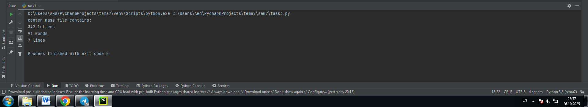  

**Вывод:** Я разобралась с анализом текстовых файлов: чтение всего текста, подсчет строк через split('\n'), слов через split() и букв через проверку isalpha().

---

### Задание 4. Напишите программу, которая получает на вход предложение, выводит его в терминал, заменяя все запрещенные слова звездочками * (количество звездочек равно количеству букв в слове). Запрещенные слова, разделенные символом пробела, хранятся в текстовом файле input.txt. Все слова в этом файле записаны в нижнем регистре. Программа должна заменить запрещенные слова, где бы они ни встречались, даже в середине другого слова. Замена производится независимо от регистра.
```python
with open('zapreshyonka.txt', 'r') as f:
    bad_words = f.read().split()

text = input("Введите предложение: ")

result = text
for word in bad_words:
    result = result.replace(word, '*' * len(word))
    result = result.replace(word.upper(), '*' * len(word))
    result = result.replace(word.capitalize(), '*' * len(word))

print(result)
```
### Результат
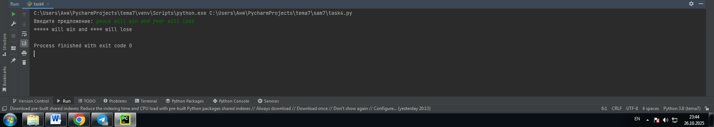  

**Вывод:** Я научилась работать с заменой слов в тексте: чтение запрещенных слов из файла, и последовательная замена каждого слова на звездочки с учетом разных регистров через методы replace().

---

### Задание 5. Самостоятельно придумайте и решите задачу, которая будет взаимодействовать с текстовым файлом. Задача: Напишите программу, которая создает файл с пожеланиями на день и позволяет добавлять новые пожелания, а также показывает все существующие.
```python
def add_wish():
    wish = input("Введите ваше пожелание на день: ")
    with open('wishes.txt', 'a', encoding='utf-8') as f:
        f.write(wish + '\n')
    print("Пожелание добавлено!")


def show_wishes():
    try:
        with open('wishes.txt', 'r', encoding='utf-8') as f:
            wishes = f.readlines()

        if not wishes:
            print("Пожеланий пока нет.")
            return

        print("\nвсе пожелания:")
        print("-" * 20)
        for i, wish in enumerate(wishes, 1):
            print(f"{i}. {wish.strip()}")

    except FileNotFoundError:
        print("Файл с пожеланиями не найден.")


while True:
    print("\n1 - Добавить пожелание")
    print("2 - Показать пожелания")
    print("3 - Выход")

    choice = input("Выберите действие: ")

    if choice == '1':
        add_wish()
    elif choice == '2':
        show_wishes()
    elif choice == '3':
        print("Хорошего дня!")
        break
    else:
        print("Неверный выбор")
```
### Результат
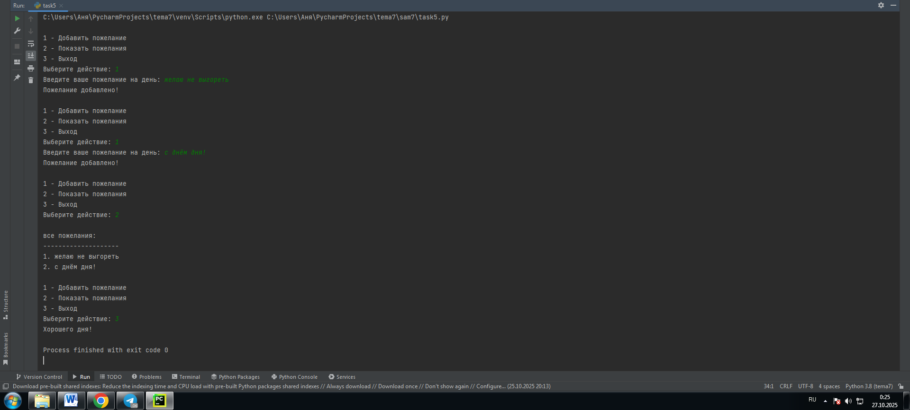  

**Вывод:** Научилась создавать простой дневник пожеланий: использование текстового файла для хранения записей, добавление новых строк через режим 'a' и чтение всех записей для отображения.

---

## Общие выводы по теме
**Выполняя задания, я освоила ключевые аспекты работы с файлами в Python. Я научилась открывать файлы в разных режимах доступа (чтение, запись, добавление), использовать менеджер контекста with open() для автоматического закрытия файлов и обрабатывать текстовые данные в различных кодировках. В работе с содержимым файлов я разобралась с методами чтения read(), readline() и readlines(), а также с построчной обработкой данных через итерацию. Для анализа текста я освоила подсчет символов, слов и строк, поиск наиболее частых элементов и замену содержимого с учетом регистра. Кроме того, я научилась сохранять структурированные данные в файлы и организовывать простое меню для взаимодействия с файловой системой через консоль.**
