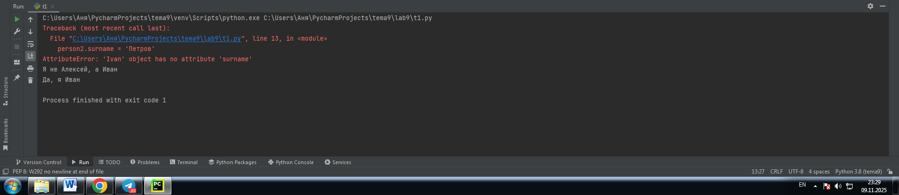
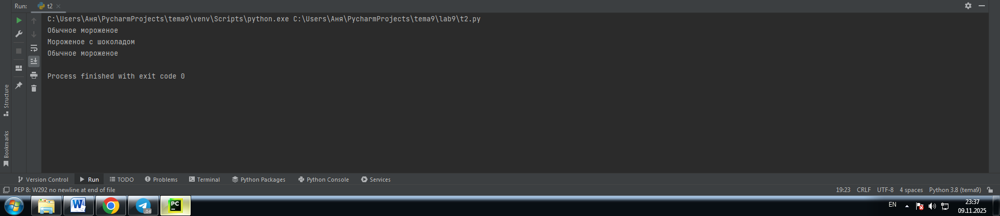
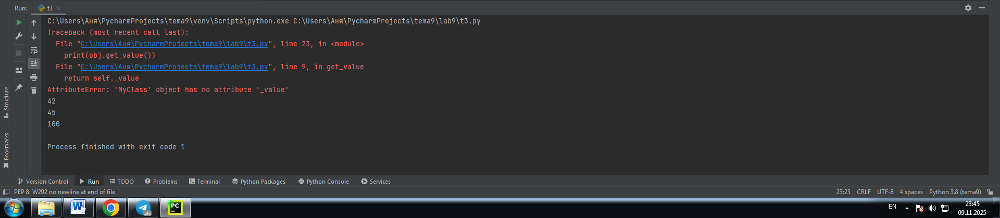
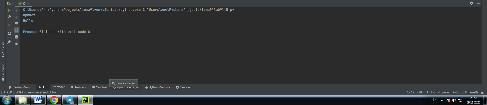
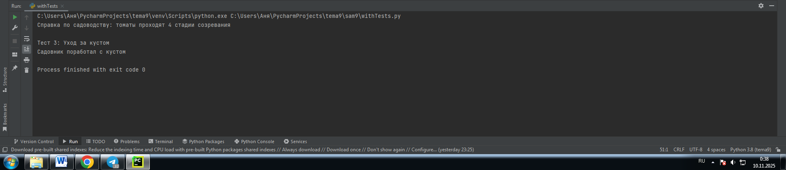
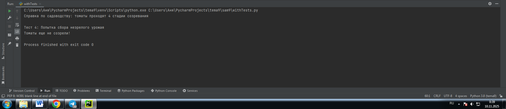
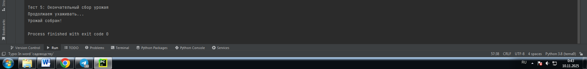

# Тема: ООП на Python: концепции, принципы и примеры реализации

- Студент: Демшина Анна Александровна
- Группа: ИВТ-23-1


## Таблица выполнения заданий

| Задание   | Лаб_раб | Сам_раб |
|-----------|:-------:|:-------:|
| Задание 1 |    +    |    +    |
| Задание 2 |    +    |    +    |
| Задание 3 |    +    |    +    |
| Задание 4 |    +    |    +    |
| Задание 5 |    +    |    +    |


## Лабораторная работа 9

### Задание 1. Допустим, что вы решили оригинально и немного странно познакомится с человеком. Для этого у вас должен быть написан свой класс на Python, который будет проверять угадал ваше имя человек или нет. Для этого создайте класс, указав в свойствах только имя. Дальше создайте функцию __init__(), а в ней сделайте проверку на то угадал человек ваше имя или нет. Также можете проверить что будет, если в этой функции указав атрибут, который не указан в вашем классе, например, попробуйте вызвать фамилию.

```python
class Ivan:
    __slots__ = ['name']
    def __init__(self, name):
        if name == 'Иван':
            self.name = f"Да, я {name}"
        else:
            self.name = f"Я не {name}, а Иван"

person1 = Ivan('Алексей')
person2 = Ivan('Иван')
print(person1.name)
print(person2.name)
person2.surname = 'Петров'
``` 
### Результат

 

**Вывод:** Я создала класс с ограничением атрибутов через __slots__. Поняла, как это предотвращает создание новых атрибутов. Научилась обрабатывать разные варианты ввода в конструкторе класса.

---

### Задание 2. Вам дали важное задание, написать продавцу мороженого программу, которая будет писать добавили ли топпинг в мороженое и цену после возможного изменения. Для этого вам нужно написать класс, в котором будет определяться изменили ли состав мороженого или нет. В этом классе реализуйте метод, выводящий на печать «Мороженое с {ТОППИНГ}» в случае наличия добавки, а иначе отобразится следующая фраза: «Обычное мороженое». При этом программа должна воспринимать как топпинг только атрибуты типа string.
```python
class Icecream:
    def __init__(self, ingredient=None):
        if isinstance(ingredient, str):
            self.ingredient = ingredient
        else:
            self.ingredient = None

    def composition(self):
        if self.ingredient:
            print(f"Мороженое с {self.ingredient}")
        else:
            print("Обычное мороженое")

icecream = Icecream()
icecream.composition()
icecream = Icecream("шоколадом")
icecream.composition()
icecream = Icecream()
icecream.composition()
```
### Результат



**Вывод:** Я научилась создавать класс с проверкой типа данных в Python. Разобралась как работает функция isinstance() для валидации входных параметров. Выполняя задание, я поняла как обрабатывать разные случаи через условные конструкции в методах класса.

---

### Задание 3. Петя – начинающий программист и на занятиях ему сказали реализовать икапсу…что-то. А вы хороший друг Пети и ко всему прочему прекрасно знаете, что икапсу…что-то – это инкапсуляция, поэтому решаете помочь вашему другу с написанием класса с инкапсуляцией. Ваш класс будет не просто инкапсуляцией, а классом с сеттером, геттером и деструктором. После написания класса вам необходимо продемонстрировать что все написанные вами функции работают. Также вас необходимо объяснить Пете почему на скриншоте ниже в консоли выводится ошибка.

```python
class MyClass:
    def __init__(self, value):
        self._value = value

    def set_value(self, value):
        self._value = value

    def get_value(self):
        return self._value

    def del_value(self):
        del self._value

    value = property(get_value, set_value, del_value, "Свойство value")

obj = MyClass(42)
print(obj.get_value())
obj.set_value(45)
print(obj.get_value())
obj.set_value(100)
print(obj.get_value())
obj.del_value()
print(obj.get_value())
```
### Результат


**Вывод:** Я разобралась как работает свойство property для управления атрибутами. Научилась создавать геттеры, сеттеры и делитеры для защищенных данных. Ошибка возникает потому, что после удаления атрибута _value методом del_value(), метод get_value() пытается обратиться к несуществующему атрибуту.

---

### Задание 4. Вам прекрасно известно, что кошки и собаки являются млекопитающими, но компьютер этого не понимает, поэтому вам нужно написать три класса: Кошки, Собаки, Млекопитающие. И при помощи “наследования” объяснить компьютеру что кошки и собаки – это млекопитающие. Также добавьте какой-нибудь свой атрибут для кошек и собак, чтобы показать, что они чем-то отличаются друг от друга.

```python
class Mammal:
    className = 'Mammal'

class Dog(Mammal):
    species = 'canine'
    sound = 'wow'

class Cat(Mammal):
    species = 'feline'
    sound = 'meow'

dog = Dog()
print(f"Dog is {dog.className}, but they say {dog.sound}")
cat = Cat()
print(f"Cat is {cat.className}, but they say {cat.sound}")
```
### Результат


**Вывод:** Я разобралась как работает наследование классов в Python. Научилась создавать дочерние классы, которые перенимают атрибуты родительского. Выполняя задание, я поняла как разные объекты могут иметь общие характеристики через наследование.

---

### Задание 5. На разных языках здороваются по-разному, но суть остается одинаковой, люди друг с другом здороваются. Давайте вместе с вами реализуем программу с полиморфизмом, которая будет описывать всю суть первого предложения задачи. Для этого мы можем выбрать два языка, например, русский и английский и написать для них отдельные классы, в которых будет в виде атрибута слово, которым здороваются на этих языках. А также напишем функцию, которая будет выводить информацию о том, как на этих языках здороваются. Заметьте, что для решения поставленной задачи мы использовали декоратор @staticmethod, поскольку нам не нужны обязательные параметры-ссылки вроде self.

```python
class Russian:
    @staticmethod
    def greeting():
        print("Привет")

class English:
    @staticmethod
    def greeting():
        print("Hello")

def greet(language):
    language.greeting()

ivan = Russian()
greet(ivan)
john = English()
greet(john)
```
### Результат



**Вывод:** Я разобралась как работает полиморфизм с статическими методами. Научилась использовать декоратор @staticmethod для создания методов без параметра self. Выполняя задание, я поняла как разные классы могут иметь методы с одинаковыми названиями но разной реализацией.

---

## Самостоятельная работа 9

### Классовая структура
```python
class Tomato:
    states = {0: 'отсутствует', 1: 'цветение', 2: 'зеленый', 3: 'красный'}

    def __init__(self, index):
        self._index = index
        self._state = 0

    def grow(self):
        if self._state < 3:
            self._state += 1

    def is_ripe(self):
        return self._state == 3


class TomatoBush:
    def __init__(self, num):
        self.tomatoes = [Tomato(i) for i in range(num)]

    def grow_all(self):
        for tomato in self.tomatoes:
            tomato.grow()

    def all_are_ripe(self):
        return all(tomato.is_ripe() for tomato in self.tomatoes)

    def give_away_all(self):
        self.tomatoes = []


class Gardener:
    def __init__(self, name, plant):
        self.name = name
        self._plant = plant

    def work(self):
        self._plant.grow_all()

    def harvest(self):
        if self._plant.all_are_ripe():
            self._plant.give_away_all()
            print("Урожай собран!")
        else:
            print("Томаты еще не созрели!")

    @staticmethod
    def knowledge_base():
        print("Справка по садоводству: томаты проходят 4 стадии созревания")
```


### Тесты

---

### Тест 1

```python
# Тест 1: Вызов справки по садоводству
print("Тест 1: Справка по садоводству")
Gardener.knowledge_base()
```
### Результат
  

**Вывод:** Я научилась вызывать статические методы класса без создания экземпляра.

---

### Тест 2
```python
# Тест 2: Создание объектов
print("\nТест 2: Создание объектов")
print(f"Создан садовник {gardener.name} с кустом из {len(bush.tomatoes)} томатов")
```
### Результат
  

**Вывод:** Я разобралась как создавать объекты разных классов и связывать их между собой.

---

### Тест 3
```python
# Тест 3: Уход за кустом
print("\nТест 3: Уход за кустом")
gardener.work()
print("Садовник поработал с кустом")
```
### Результат
  

**Вывод:** Я поняла как методы одного класса могут влиять на состояние объектов другого класса.

---

### Тест 4
```python
# Тест 4: Попытка сбора незрелого урожая
print("\nТест 4: Попытка сбора незрелого урожая")
gardener.harvest()
```
### Результат
  

**Вывод:** Я научилась обрабатывать ситуации, когда условия для выполнения операции не выполнены.

---

### Тест 5
```python
# Тест 5: Окончательный сбор урожая
print("\nТест 5: Окончательный сбор урожая")
print("Продолжаем ухаживать...")
gardener.work()
gardener.work()
gardener.harvest()
```
### Результат 
  

**Вывод:** Я освоила последовательное выполнение операций для достижения нужного результата.

---

## Общие выводы по теме
**Изучая объектно-ориентированное программирование, я разобралась с созданием классов и работой с объектами. Через практические задания я освоила основные принципы ООП: инкапсуляцию для защиты данных, наследование для расширения функциональности и полиморфизм для гибкости кода. Реализация проекта "Садовник и помидоры" продемонстрировала, как эти концепции применяются вместе для построения структурированных приложений.**
