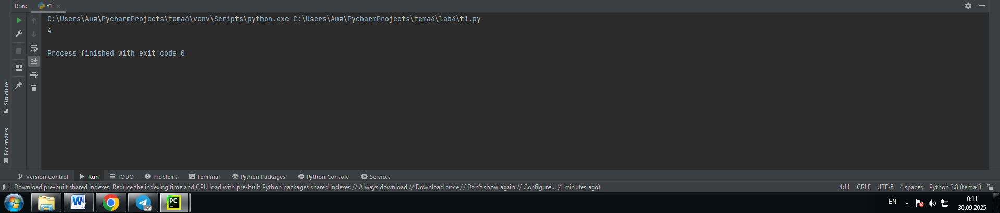
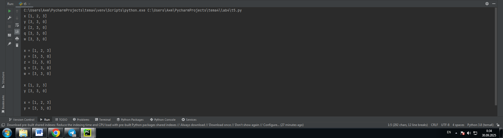
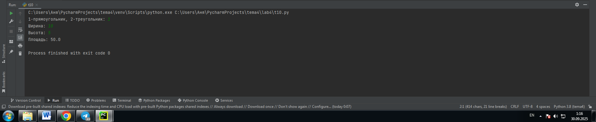
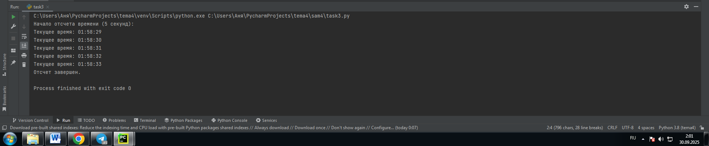
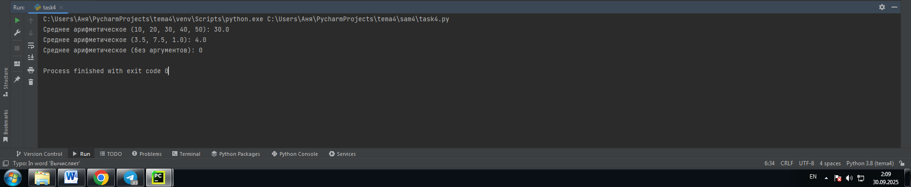

# Тема: Функции и модули

- Студент: Демшина Анна Александровна
- Группа: ИВТ-23-1


## Таблица выполнения заданий

| Задание   | Лаб_раб | Сам_раб |
|-----------|:-------:|:-------:|
| Задание 1 |    +    |    +    |
| Задание 2 |    +    |    +    |
| Задание 3 |    +    |    +    |
| Задание 4 |    +    |    +    |
| Задание 5 |    +    |    +    |
| Задание 6 |    +    |         |
| Задание 7 |    +    |         |
| Задание 8 |    +    |         |
| Задание 9 |    +    |         |
| Задание 10|    +    |         |


## Лабораторная работа 4

### Задание 1. Напишите функцию, которая выполняет любые арифметические действия и выводит результат в консоль. Вызовите функцию используя “точку входа”.

```python
def main():
    print(2+2)

if __name__ == '__main__':
    main()
``` 
### Результат

 

**Вывод:** Функция main() вызывается только при прямом запуске скрипта, итоговый вывод в консоли будет: 4.

---

### Задание 2. Напишите функцию, которая выполняет любые арифметические действия, возвращает при помощи return значение в место, откуда вызывали функцию. Выведите результат в консоль. Вызовите функцию используя “точку входа”.

```python
def main():
    return 2+2

if __name__ == '__main__':
    print(main())
```
### Результат


**Вывод:** Ключевое отличие: функция main() возвращает значение 4 с помощью return, а не печатает его напрямую. Затем основная часть скрипта (if __name__ == '__main__':) печатает то, что вернула функция. Итоговый вывод в консоли будет: 4.

---

### Задание 3. Напишите функцию, в которую передаются два аргумента, над ними производится арифметическое действие, результат возвращается туда, откуда эту функцию вызывали. Выведите результат в консоль. Вызовите функцию в любом небольшом цикле.

```python
def main(one, two):
    result = one + two
    return result

for i in range(5):
    x = 1
    y = 10
    answer = main(x, y)
    print(answer)
```
### Результат


**Вывод:** Функция main(one, two) возвращает сумму, и цикл for вызывает ее 5 раз с одинаковыми аргументами.

---

### Задание 4. Напишите функцию, на вход которой подается какое-то изначальное неизвестное количество аргументов, над которыми будет производится арифметические действия. Для выполнения задания необходимо использовать кортеж “*args”.

```python
def main(x, *args):
    one = x
    two = sum(args)
    three = float(len(args))
    print(f"one={one}\ntwo={two}\nthree={three}")

    return x + sum(args) / float(len(args))

if __name__ == '__main__':
    result = main(10, 0, 1, 2, -1, 0, -1, 1, 2)
    print(f"\nresult={result}")
```
### Результат


**Вывод:** Код вычисляет среднее арифметическое списка из восьми чисел и прибавляет его к первому числу (10). Функция main принимает 10 и кортеж (0,1,2,−1,0,−1,1,2). Сумма этих восьми чисел равна 4, а их количество — 8. Функция возвращает 10.5. Скрипт сначала печатает промежуточные значения one=10, two=4, three=8.0, а затем финальный результат result=10.5.

---

### Задание 5. Напишите функцию, которая на вход получает кортеж “**kwargs” и при помощи цикла выводит значения, поступившие в функцию. На скриншоте ниже указаны два варианта вызова функции с “**kwargs” и два варианта работы с данными, поступившими в эту функцию. Комментарии в коде и теоретическая часть помогут вам разобраться в этом нелегком аспекте. Вызовите функцию используя “точку входа”.

```python
def main(**kwargs):
    for i in kwargs.items():
        print(i[0], i[1])

    print()

    for key in kwargs:
        print(f"{key} = {kwargs[key]}")

if __name__ == '__main__':
    main(x=[1,2,3], y=[3,3,0], z=[2,3,0],q=[3,3,0],w=[3,3,0])
    print()
    main(**{'x':[1,2,3],'y': [3,3,0]})
```
### Результат



**Вывод:** Код печатает все пары ключ-значение из словаря дважды, используя разные методы итерации. Сначала он выводит пары в виде: ключ значение. Затем он выводит их в виде: ключ = значение.

---

### Задание 6. Напишите две функции. Первая – получает в виде параметра “**kwargs”. Вторая считает среднее арифметическое из значений первой функции. Вызовите первую функцию используя “точку входа” и минимум 4 аргумента.

```python
def main(**kwargs):

    for i, j in kwargs.items():
        print(f"{i}. Mean = {mean(j)}")

def mean(data):
    return sum(data) / float(len(data))

if __name__ == '__main__':
    main(x=[1,2,3], y=[3,3,0])
```
### Результат


**Вывод:** Код вычисляет и печатает среднее арифметическое для каждого списка, переданного в функцию.

---

### Задание 7. Создайте дополнительный файл .py. Напишите в нем любую функцию, которая будет что угодно выводить в консоль, но не вызывайте ее в нем. Откройте файл main.py, импортируйте в него функцию из нового файла и при помощи “точки входа” вызовите эту функцию.
```python
def say_hello():
    print('Hello everyone!')
```
---

```python
from for_import import say_hello

if __name__ == '__main__':
    say_hello()
```
### Результат


**Вывод:** Код показывает, как использовать функцию из другого файла. Функция say_hello() определена в файле for_import.py. Строка from for_import import say_hello загружает эту функцию. Затем скрипт просто вызывает импортированную функцию.

---

### Задание 8.Напишите программу, которая будет выводить корень, синус, косинус полученного от пользователя числа.
```python
from math import *
def main():
    value = int(input('Введите значение: '))
    print(sqrt(value))
    print(sin(value))
    print(cos(value))

if __name__ == '__main__':
    main()
```
### Результат


**Вывод:** Код вычисляет корень, синус и косинус числа, которое вводит пользователь. Я узнала, как это можно реализовать тремя способами импорта функций из модуля math.

---

### Задание 9. Напишите программу, которая будет рассчитывать какой день недели будет через n-нное количество дней, которые укажет пользователь.
```python
from datetime import datetime as dt
from datetime import timedelta as td

def main():
    print(
        f"Сегодня {dt.today().date()}. "
        f"День недели - {dt.today().isoweekday()}. "
    )
    n = int(input('Введите количсетво дней: '))
    today = dt.today()
    result = today + td(days=n)
    print(
        f"Через {n} дней будет {result.date()}. "
        f"День недели - {result.isoweekday()}"
    )

if __name__ == '__main__':
    main()
```
### Результат


**Вывод:** Код вычисляет будущую дату через N дней. Он использует алиасы (dt и td) для datetime и timedelta.

---

### Задание 10. Напишите программу с использованием глобальных переменных, которая будет считать площадь треугольника или прямоугольника в зависимости от того, что выберет пользователь. Получение всей необходимой информации реализовать через input(), а подсчет площадей выполнить при помощи функций. Результатом программы будет число, равное площади необходимой фигуры.
```python
global result

def rectangle():
    a = float(input("Ширина: "))
    b = float(input("Высота: "))
    global result
    result = a * b

def triangle():
    a = float(input("Основание: "))
    h = float(input("Высота: "))
    global result
    result = 0.5 * a * h

figure = input("1-прямоугольник, 2-треугольник: ")

if figure == '1':
    rectangle()
elif figure == '2':
    triangle()

print(f"Площадь: {result}")
```
### Результат



**Вывод:** Код вычисляет площадь геометрической фигуры (прямоугольника или треугольника), используя глобальную переменную для сохранения результата.

## Самостоятельная работа 4

### Задание 1. Дайте подробный комментарий для кода, написанного ниже. Комментарий нужен для каждой строчки кода, нужно описать что она делает. Не забудьте, что функции комментируются по-особенному.
```python
# Импортируем класс datetime для работы со временем, используя его напрямую
from datetime import datetime
# Импортируем функцию квадратного корня (sqrt) из модуля math
from math import sqrt

# Функция main
# Определяем функцию main, принимающую именованные аргументы как словарь (kwargs).
def main(**kwargs):
    # Итерируем по элементам словаря (кортежам вида (ключ, значение)).
    for key in kwargs.items():
        # Вычисляем гипотенузу (длину вектора) по теореме Пифагора для [x, y] списка-значения (key[1]).
        # key[1][0] - первое число, key[1][1] - второе число.
        # В коде есть опечатка (вместо ** стоит 2). Анализируем код как есть:
        result = sqrt(key[1][0] ** 2 + key[1][1] ** 2)
        # Печатаем полученный результат.
        print(result)

# Блок исполнения
# Проверяем, запущен ли скрипт напрямую.
if __name__ == '__main__':
    # Фиксируем текущее время для измерения длительности выполнения.
    start_time = datetime.now()
    # Вызываем main, передавая словари с парами чисел.
    main(
        one=[10,3],
        # Ключ 'two', значение [5, 4]
        two=[5,4],
        # Ключ 'three', значение [15, 13]
        three=[15,13],
        # Ключ 'four', значение [93, 53]
        four=[93,53],
        # Ключ 'five', значение [133, 15]
        five=[133,15]
    )
    # Вычисляем время, затраченное на выполнение функции main.
    time_costs = datetime.now() - start_time
    # Печатаем затраченное время выполнения.
    print(f"Время выполнения команды - {time_costs}")
```
### Результат
  

**Вывод:** Выполнение этого задания научило меня тщательно разбирать код построчно, чтобы точно понимать роль каждого оператора, включая импорт модулей с алиасами (from datetime import datetime), объявление функций с особыми аргументами (**kwargs), и сложные вычисления в циклах, а также необходимость комментирования каждой строки для полной ясности и документации кода.

---

### Задание 2. Напишите программу, которая будет заменять игральную кость с 6 гранями. Если значение равно 5 или 6, то в консоль выводится «Вы победили», если значения 3 или 4, то вы рекурсивно должны вызвать эту же функцию, если значение 1 или 2, то в консоль выводится «Вы проиграли». При этом каждый вызов функции необходимо выводить в консоль значение “кубика”. Для выполнения задания необходимо использовать стандартную библиотеку random. Программу нужно написать, используя одну функцию и “точку входа”.
```python
import random

def game():
    # Генерация случайного целого числа от 1 до 6 (бросок кости)
    value = random.randint(1, 6)

    # Вывод текущего результат броска
    print(f"Кубик: {value}")

    if value >= 5:
        # Условие победы (5 или 6)
        print("Вы победили")
        # Возвращение результата, чтобы остановить рекурсию
        return "Победа"
    elif value >= 3:
        # Условие переброса (3 или 4)
        print("Переброс...")
        # Рекурсивный вызов функции
        return game()
    else:
        # Условие проигрыша (1 или 2)
        print("Вы проиграли")
        # Возвращение результата, чтобы остановить рекурсию
        return "Проигрыш"

if __name__ == '__main__':
    # Вызов основной функции для начала игры
    game()
```
### Результат
  

**Вывод:** Выполняя это задание, я научилась, как реализовать рекурсивную логику игры в кости с использованием одной функции.

---

### Задание 3. Напишите программу, которая будет выводить текущее время, с точностью до секунд на протяжении 5 секунд. Программу нужно написать с использованием цикла. Подсказка: необходимо использовать модуль datetime и time, а также вам необходимо как-то “усыплять” программу на 1 секунду.
```python
import datetime
import time

def time_for_now():
    """
    Выводит текущее время с точностью до секунд 5 раз, с задержкой в 1 секунду между выводами.
    """
    print("Начало отсчета времени (5 секунд):")

    # Цикл выполнится 5 раз (i примет значения от 0 до 4)
    for i in range(5):
        # Текущее время и дата
        current_time = datetime.datetime.now()

        # Форматирование времени для вывода только часов, минут и секунд
        time_str = current_time.strftime("%H:%M:%S")

        # Вывод текущего времени
        print(f"Текущее время: {time_str}")

        # "Усыпляем" программу на 1 секунду
        time.sleep(1)


# Точка входа в программу
if __name__ == '__main__':
    # Вызыов функции time_for_now для начала отсчета
    time_for_now()
    print("Отсчет завершен.")
```
### Результат
  

**Вывод:** Я научилась тому, как сочетать цикличность с функцией задержки(time.sleep(1)) для создания временных интервалов в программе. Это позволило мне пять раз с интервалом в одну секунду получать и форматировать текущее время с помощью модуля datetime.

---

### Задание 4. Напишите программу, которая считает среднее арифметическое от аргументов вызываемое функции, с условием того, что изначальное количество этих аргументов неизвестно. Программу необходимо реализовать используя одну функцию и “точку входа".
```python
def calculate_average(*numbers):
    """
    Вычисляет среднее арифметическое от переданных аргументов.Использует *numbers для принятия любого количества позиционных аргументов.
    """
    # Проверяем, были ли переданы какие-либо аргументы, чтобы избежать деления на ноль.
    if not numbers:
        return 0
    # sum(numbers) вычисляет сумму всех элементов кортежа numbers.
    total_sum = sum(numbers)
    # len(numbers) определяет количество элементов.
    count = len(numbers)

    # Вычисляем среднее арифметическое.
    average = total_sum / count
    return average

# Точка входа в программу
if __name__ == '__main__':
    # Вызов с целыми числами
    avg1 = calculate_average(10, 20, 30, 40, 50)
    print(f"Среднее арифметическое (10, 20, 30, 40, 50): {avg1}")

    # Вызов с дробными числами и разным количеством
    avg2 = calculate_average(3.5, 7.5, 1.0)
    print(f"Среднее арифметическое (3.5, 7.5, 1.0): {avg2}")

    # Вызов без аргументов
    avg3 = calculate_average()
    print(f"Среднее арифметическое (без аргументов): {avg3}")
```
### Результат
  

**Вывод:** Выполняя это задание, я научилась, как использовать позиционный аргумент сбора (*numbers) для создания гибкой функции, которая может принять неизвестное заранее количество аргументов. Это позволило мне корректно вычислить среднее арифметическое, а также учесть защиту от деления на ноль при отсутствии аргументов.

---

### Задание 5. Создайте два Python файла, в одном будет выполняться вычисление площади треугольника при помощи формулы Герона (необходимо реализовать через функцию), а во втором будет происходить взаимодействие с пользователем (получение всей необходимой информации и вывод результатов). Напишите эту программу и выведите в консоль полученную площадь.
```python
import math

def calculate_triangle_area(a, b, c):
    """
    Вычисляет площадь треугольника по формуле Герона.

    """
    # Проверка на существование треугольника (сумма двух сторон должна быть больше третьей)
    if a + b <= c or a + c <= b or b + c <= a:
        print("Ошибка: Треугольник с такими сторонами не существует.")
        return None

    # 1. Вычисление полупериметра (p)
    p = (a + b + c) / 2

    # 2. Вычисление площади по формуле Герона: sqrt(p * (p-a) * (p-b) * (p-c))
    area = math.sqrt(p * (p - a) * (p - b) * (p - c))

    return area
```

---

```python
# Импортируем функцию из файла heron_calculator.py
from calc import calculate_triangle_area

def main():
    """
    Основная функция для взаимодействия с пользователем и вывода результатов.
    """
    print("Расчет площади треугольника по формуле Герона ")

    try:
        # Получение длин сторон от пользователя
        a = float(input("Введите длину стороны A: "))
        b = float(input("Введите длину стороны B: "))
        c = float(input("Введите длину стороны C: "))

        # Проверка на отрицательные значения
        if a <= 0 or b <= 0 or c <= 0:
            print("Ошибка: Длины сторон должны быть положительными числами.")
            return

        # Вызов импортированной функции для вычисления площади
        area = calculate_triangle_area(a, b, c)

        # Вывод результата
        if area is not None:
            print(f"\nПлощадь треугольника с сторонами {a}, {b}, {c} равна: {area:.2f}")

    except ValueError:
        print("Ошибка: Введите числовое значение для длины стороны.")


# Точка входа в программу
if __name__ == '__main__':
    main()
```
### Результат
  

**Вывод:** Выполнение этого задания научило меня организовывать программу между разными файлами. Разделение задач: я научилась отделять логику вычислений (функцию Герона) в один файл от пользовательского интерфейса в другой файл. Связь: я закрепила, как подключать готовую функцию из файла-библиотеки в основной исполняемый файл с помощью оператора from... import для получения результата.

---

## Общие выводы по теме
**Функции и модули — это основа структуры и организации кода в Python. Я освоила, как управлять программами: используя функции (def) для инкапсуляции логики и многократного применения кода (включая рекурсивные вызовы), а модули (import) — для доступа к готовым библиотекам (math, datetime) и разделения собственного кода на чистые, независимые файлы, что является ключевым для разработки.**
